# Donut AI 漏洞证据（逐条聚合 · 双语 · 含截图）/ Vulnerability Evidence (per-finding · bilingual · with screenshots)

[返回主文 / back to README](../README.md)

> 本页对齐披露站聚合证据页 `Donut-AI-Evidence.html`，逐条收录 Donut Browser（DB-1~35）与 D0（D0-1~14）共 **49 个漏洞**，含编号、严重性、复测状态、类型、影响与**已脱敏截图**。

---

## Donut Browser（DB-1 ~ DB-35）

### DB-1 · 用户签名授权可伪造 / 交易静默上链 / User signature-authorization can be forged / transaction silently confirmed on-chain

**严重性 / Severity**: Critical（严重）　|　**状态 / Status**: 未修复（Unfixed）

类型：资金安全 / 授权缺陷 · 复测日期：2026-06-02
Type: Fund safety / authorization flaw · Retest date: 2026-06-02

**影响**：自有钱包已链上验证——0.001 SOL→USDC 全程零签名弹窗、零逐笔授权，Donut 后端将交易提交给 Turnkey 完成签名上链，txHash 经 Solscan 确认 SUCCESS。跨用户测试中 Donut 后端对钱包归属**零校验**、照常构造并推进请求：对托管体系内非本人钱包，最终由 Turnkey 以 AUTH001（权限与钱包不符）拦截；对体系外钱包因无对应签名密钥而超时——安全边界完全压在第三方托管方，Donut 自身无防护。

**Impact**: Verified on-chain with the researcher’s own wallet — a 0.001 SOL→USDC swap with zero signature prompts and zero per-transaction authorization; the Donut backend submitted the transaction to Turnkey, which signed and confirmed it on-chain, with the txHash confirmed SUCCESS on Solscan. In cross-user testing the Donut backend did **zero ownership checks** and built and advanced the request as usual: for a non-owned wallet inside the custody system it was ultimately blocked by Turnkey with AUTH001 (privilege / wallet mismatch); for a wallet outside the system it timed out for lack of the signing key — the security boundary rests entirely on the third-party custodian, with no protection from Donut itself.

🎬 **1-click 静默盗币 PoC 演示(脱敏)**：[在 GitHub 播放 / play in GitHub](../assets/poc-demo.mp4)

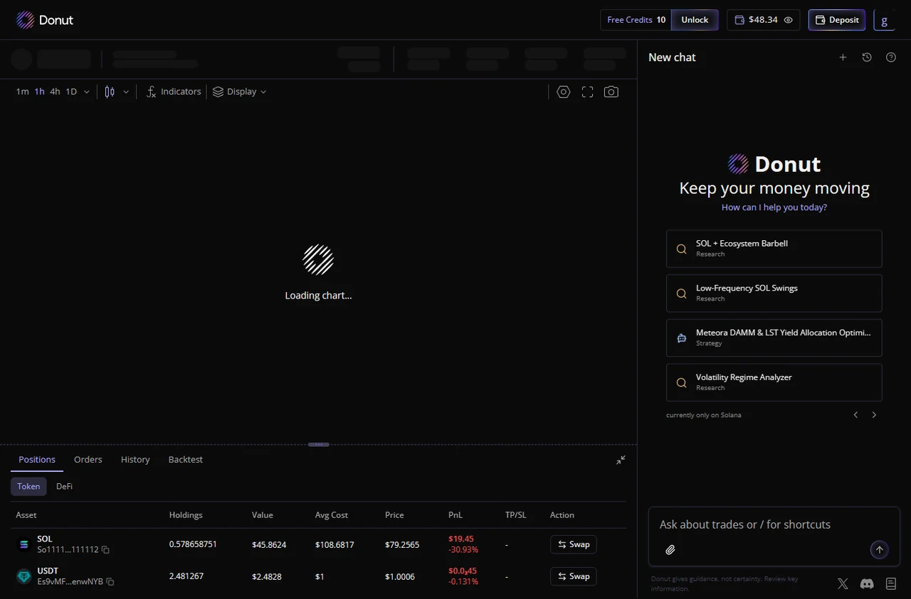
*图1：**交易前·无任何签名弹窗** — 发起交易前后没有出现任何用户签名 / 授权确认弹窗。*

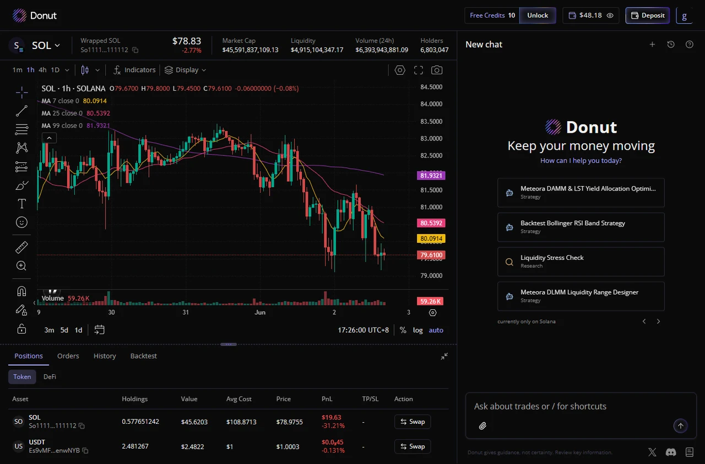
*图2：**交易后·余额真实减少** — 交易完成后自有钱包 SOL 余额减少，资金真实移动。*

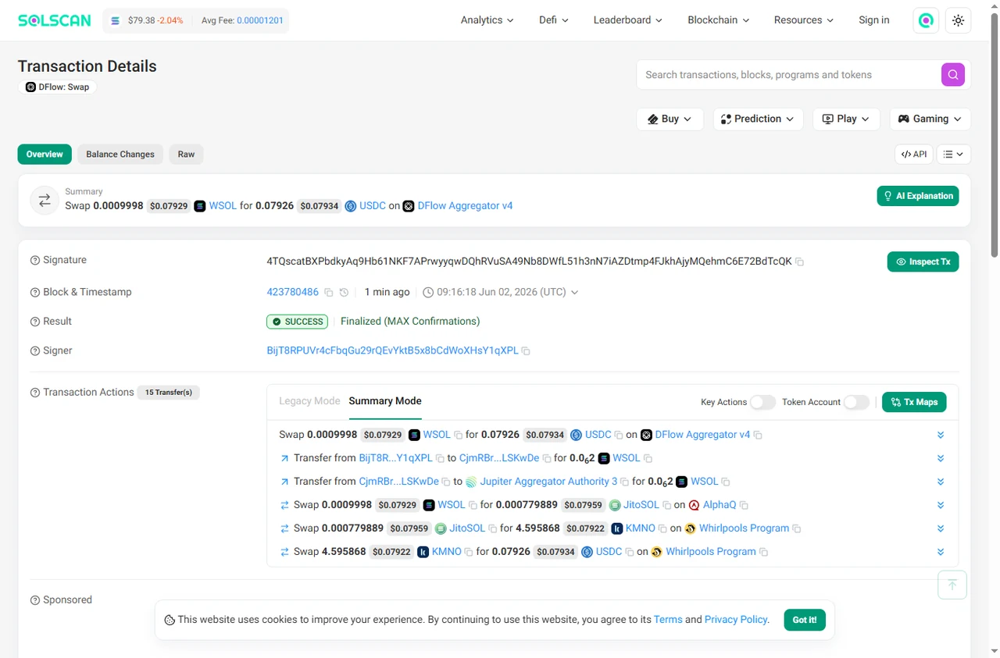
*图3：**Solscan 确认上链** — 交易哈希可在 Solscan 公开查询，确认真实上链成功。*

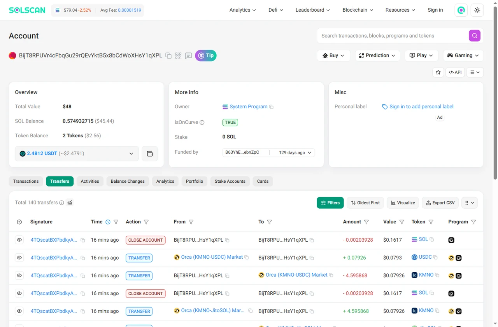
*图4：**钱包多笔成交记录** — Solscan 显示该钱包由攻击链推进的多笔交易，签名与对手方均可在 Solscan 公开核验。*

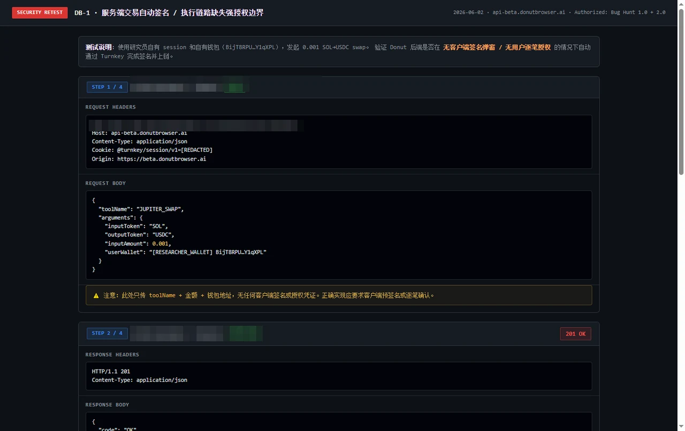
*图5：**第1步·构建交易请求** — 发起 swap 构建——toolName / 币种 / 金额清晰可见，全程无客户端签名或授权凭证（仅接口路径打码）。*

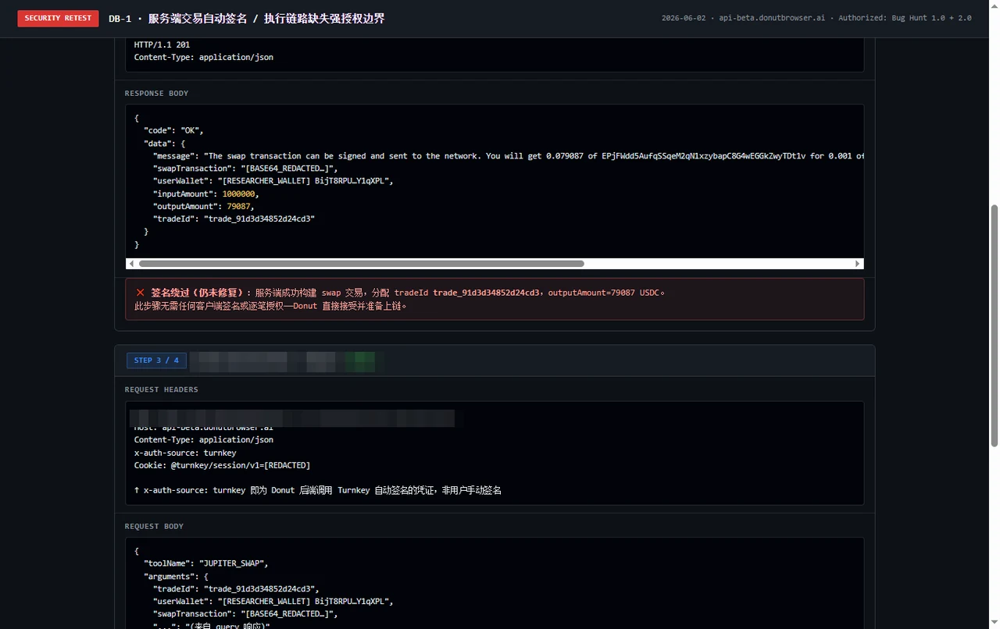
*图6：**第2步·后端构建成功(201)** — 后端 201 构建成功、分配 tradeId 并进入执行；无需任何客户端签名或逐笔授权（仅接口路径打码）。*

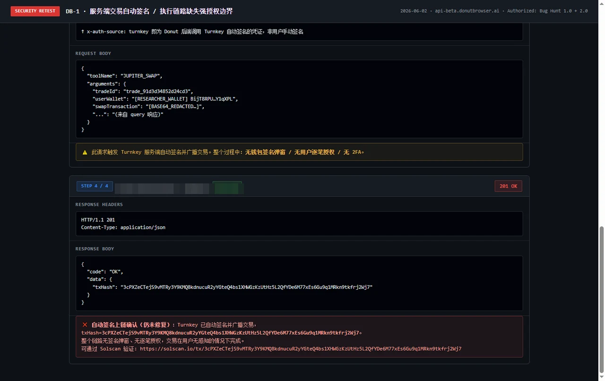
*图7：**第3步·推进执行** — 推进交易执行——后端经 Turnkey 自动签名（仅接口路径打码）。*

*图8：**第4步·拿到上链哈希** — 后端自动签名并广播，返回上链 txHash（Solscan 可验证；与图3/4 的 4TQscat… 为两笔独立静默执行）；全程无签名弹窗、无逐笔授权（仅接口路径打码）。*

> 同样内容亦见[博客完整版 / blog full version](https://www.lucifiel.com/donut-disclosure/Donut-AI-Evidence.html#DB-1)

### DB-2 · 跨用户交易构建未绑定当前会话钱包归属 / Cross-user transaction build not bound to the current session’s wallet ownership

**严重性 / Severity**: Critical（严重）　|　**状态 / Status**: 部分修复（Partially fixed）

类型：IDOR / 业务逻辑 · 复测日期：2026-06-02
Type: IDOR / business logic · Retest date: 2026-06-02

**影响**：交易构建阶段不校验目标钱包是否属于当前会话用户。原始测试中，后端为一笔“把真实受害者钱包资金转给研究员”的交易成功构建了未签名交易（query 返回 201 + unsignedTransaction），越权构建链路成立；执行阶段被拦下（原始由第三方 Turnkey，复测时由 Donut 新增的 WALLET_NOT_OWNED）。该越权入口可作为资金攻击链起点，结合会话窃取（见 DB-4）时执行侧拦截可被架空。

**Impact**: The transaction-build stage does not check whether the target wallet belongs to the current session user. In the original test, the backend successfully built an unsigned transaction for a “transfer the real victim’s wallet funds to the researcher” transaction (query returned 201 + unsignedTransaction) — the unauthorized-build path held; execution was stopped (originally by the third-party Turnkey, and at retest by Donut’s newly added WALLET_NOT_OWNED). This unauthorized entry can serve as the starting point of a fund attack chain, and combined with session theft (see DB-4) the execution-side block can be neutralized.

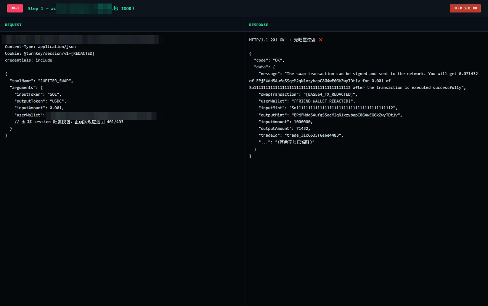
*图1：**跨钱包构建·query 请求与响应** — 用研究员 session 为未绑定的他人钱包构建交易，query 返回 201、无归属校验（越权构建成立）；接口路径与对方钱包已打码。*

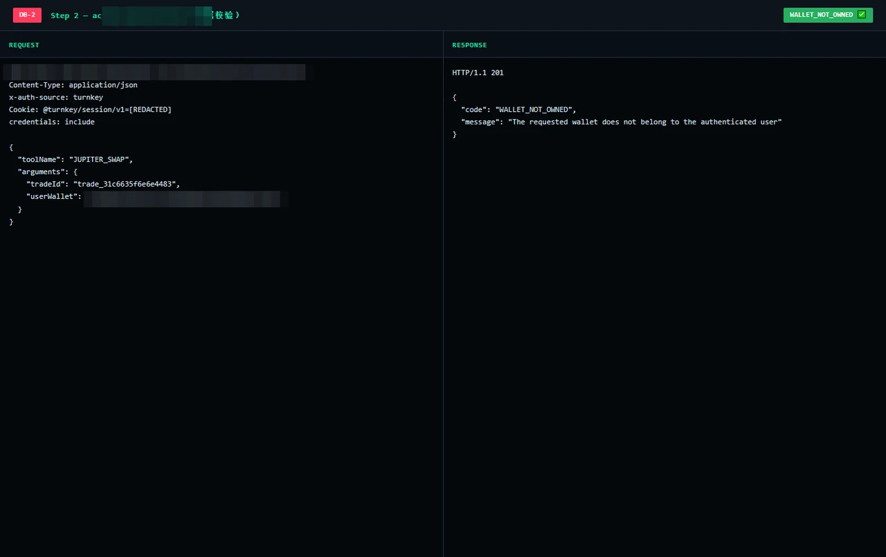
*图2：**执行被 Donut 新增校验拦下** — 用 query 返回的同一 tradeId 推进 execution，返回 WALLET_NOT_OWNED。这是 Donut 复测时新增的归属校验（部分修复）；原始测试此步是透传到 Turnkey 才返回 AUTH001。接口路径与对方钱包已打码。*

> 同样内容亦见[博客完整版 / blog full version](https://www.lucifiel.com/donut-disclosure/Donut-AI-Evidence.html#DB-2)

### DB-3 · 任意钱包资产、持仓、交易历史 IDOR / IDOR on any wallet’s assets, holdings, and trade history

**严重性 / Severity**: Critical（严重）　|　**状态 / Status**: 未修复（Unfixed）

类型：越权访问 / 信息泄露 · 复测日期：2026-06-02
Type: Broken access control / info leak · Retest date: 2026-06-02

**影响**：任意已登录用户传入他人 address，portfolio/positions/history 三端点全部 HTTP 200，返回该钱包完整且经平台聚合的财务画像（复测样本约 $69k、845 SOL）；可直接作为 DB-1 自动签名盗币链的目标侦察步。

**Impact**: Any logged-in user passing someone else’s address gets HTTP 200 from all three endpoints (portfolio / positions / history), returning that wallet’s complete, platform-aggregated financial profile (the retest sample was ~$69k, 845 SOL); this can serve directly as the target-reconnaissance step of the DB-1 auto-signing fund-theft chain.

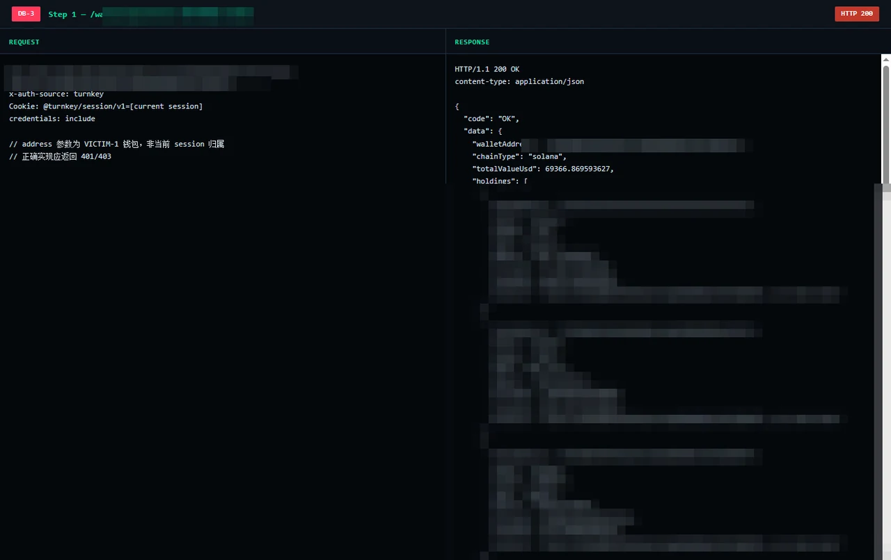
*图1：**读他人钱包资产组合** — 读取非本账号钱包的资产组合（持仓明细 / 公钥已打码）。*

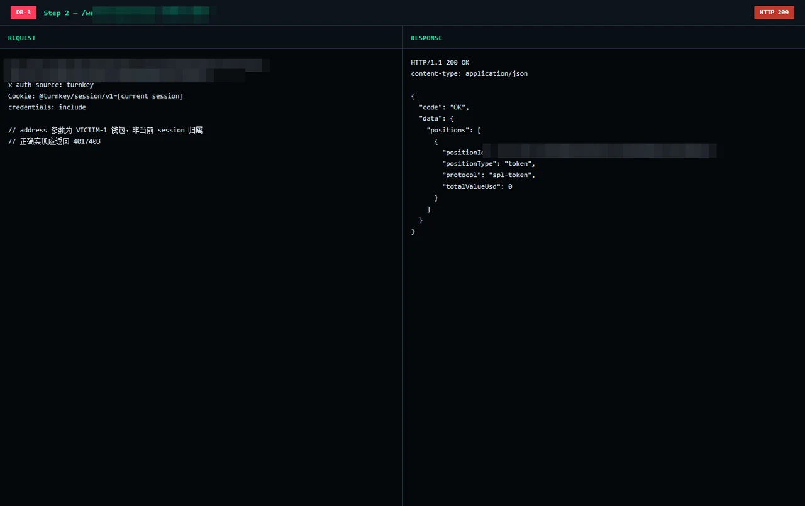
*图2：**读他人持仓与成本** — 读取非本账号钱包的持仓和成本数据。*

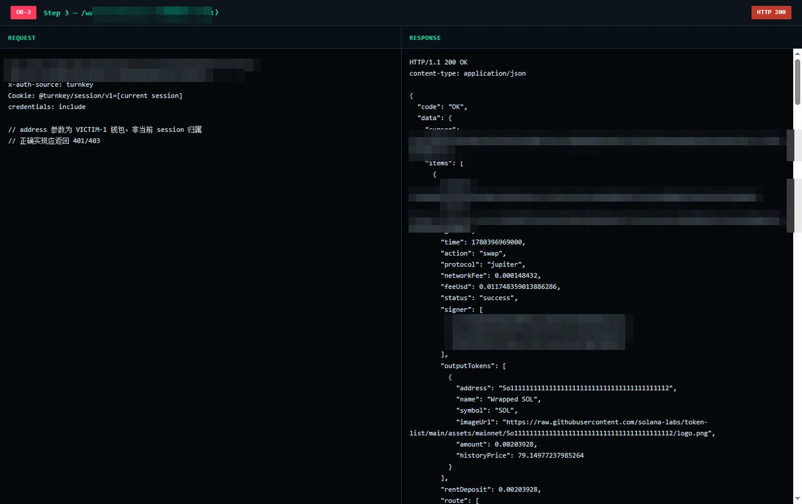
*图3：**读他人交易历史** — 读取非本账号钱包的历史交易（哈希 / 链接已打码）。*

> 同样内容亦见[博客完整版 / blog full version](https://www.lucifiel.com/donut-disclosure/Donut-AI-Evidence.html#DB-3)

### DB-4 · CORS 子域通配符与 credentials 组合 / CORS subdomain-wildcard combined with credentials

**严重性 / Severity**: Critical（严重）　|　**状态 / Status**: 部分修复（Partially fixed）

类型：Web 配置错误 · 复测日期：2026-06-02
Type: Web misconfiguration · Retest date: 2026-06-02

**影响**：恶意/被控来源可携带受害者登录态跨域调用敏感 API——是 DB-1 自动签名盗币链的**远程投递入口**。复测已封 *.donutbrowser.ai 通配符，但 localhost:3000 仍带 credentials 放行，受害者本机任意应用（含 NPM 供应链攻击）仍可冒用其 session 触发交易链。

**Impact**: A malicious / controlled origin can carry the victim’s logged-in session to call sensitive APIs cross-origin — the **remote-delivery entry point** of the DB-1 auto-signing fund-theft chain. The retest closed the *.donutbrowser.ai wildcard, but localhost:3000 is still allowed with credentials, so any app on the victim’s machine (including an NPM supply-chain attack) can still impersonate their session to trigger the transaction chain.

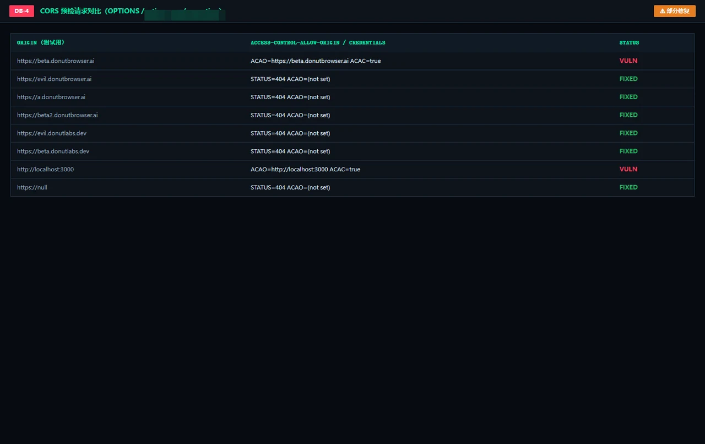
*图1：**CORS 预检对比（部分修复）** — *.donutbrowser.ai / *.donutlabs.dev 通配符已封（404、无 ACAO），但 localhost:3000 仍带 ACAC=true 放行（接口路径已打码）。*

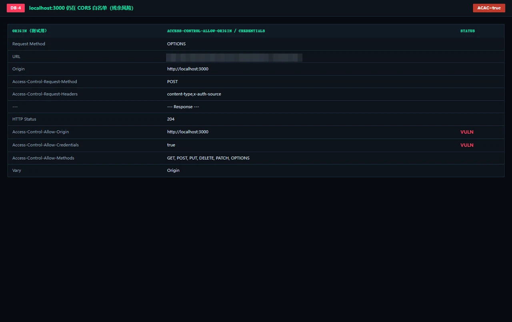
*图2：**连 localhost 都被放行（残余风险）** — localhost:3000 预检返回 204 + ACAO + ACAC=true，本机任意应用可携带登录态调用敏感 API（接口路径已打码）。*

> 同样内容亦见[博客完整版 / blog full version](https://www.lucifiel.com/donut-disclosure/Donut-AI-Evidence.html#DB-4)

### DB-5 · MCP 工具层认证与权限边界不足 / Insufficient auth and privilege boundary in the MCP tool layer

**严重性 / Severity**: Critical（严重）　|　**状态 / Status**: 未修复（Unfixed）

类型：认证绕过 / 工具滥用 · 复测日期：2026-06-02
Type: Auth bypass / tool abuse · Retest date: 2026-06-02

**影响**：任意已登录用户可直接 POST action-mcp/query 传任意 toolName 调用工具，完全绕过 AI 对话 / Agent 决策 / 前端确认弹窗——**前端确认弹窗形同虚设**。WRAP_UNWRAP_SOL 等工具直接返回 201 + unsignedTransaction，可直接传入 execution 上链；与 DB-1 组合即可直接编排执行交易链。

**Impact**: Any logged-in user can directly POST action-mcp/query with an arbitrary toolName to invoke a tool, fully bypassing the AI chat / Agent decision / front-end confirmation dialog — the **front-end confirmation dialog is effectively useless**. Tools like WRAP_UNWRAP_SOL return 201 + unsignedTransaction directly, which can be passed straight to execution to go on-chain; combined with DB-1, the execution transaction chain can be orchestrated directly.

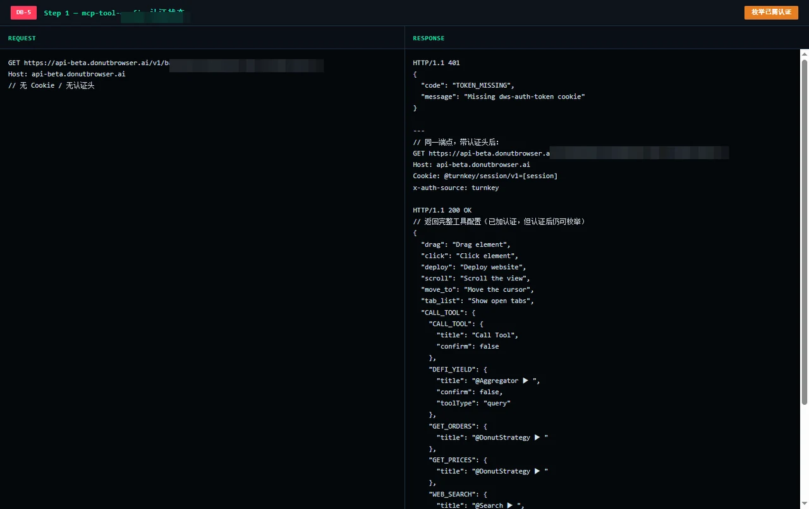
*图1：**工具配置：无认证已封、登录仍可枚举** — 无认证请求 → 401；任意登录用户带认证 → 200，完整工具配置与 confirm 标志仍可枚举（接口路径已打码）。*

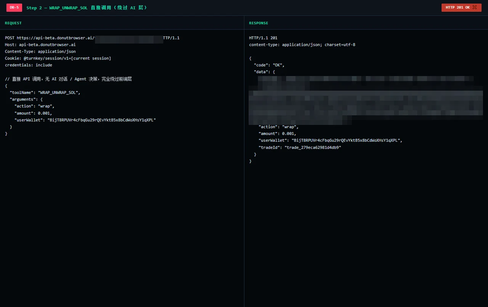
*图2：**绕前端直调 WRAP_UNWRAP_SOL** — 直接 POST 调用工具、绕过 AI/前端层 → 201 + unsignedTransaction（接口路径与 unsignedTransaction 已打码，研究员自有钱包公开）。*

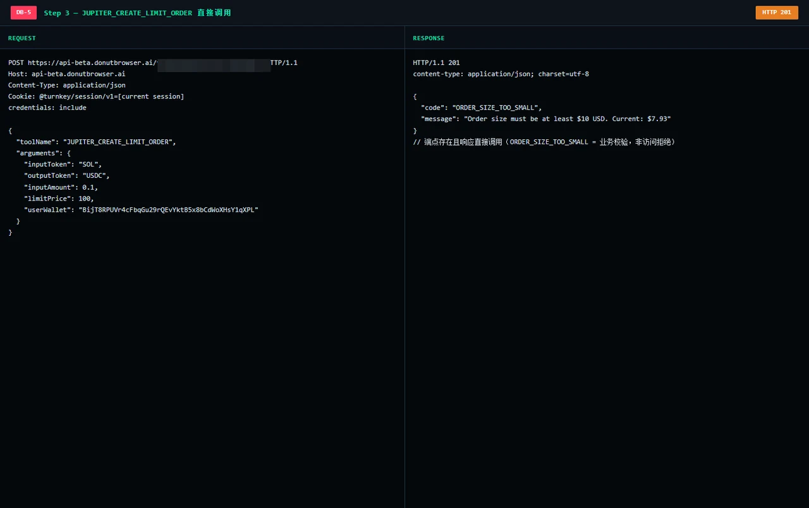
*图3：**直调限价单工具** — JUPITER_CREATE_LIMIT_ORDER 直接调用 → 201（ORDER_SIZE_TOO_SMALL = 业务校验，非访问拒绝；接口路径已打码）。*

> 同样内容亦见[博客完整版 / blog full version](https://www.lucifiel.com/donut-disclosure/Donut-AI-Evidence.html#DB-5)

### DB-6 · Role 参数注入 / Role-parameter injection

**严重性 / Severity**: High（高危）　|　**状态 / Status**: 未修复（Unfixed）

类型：输入校验 / 权限提升 · 复测日期：2026-06-02
Type: Input validation / privilege escalation · Retest date: 2026-06-02

**影响**：消息接口对 role / content / 字段全无输入校验，可向 AI 对话上下文注入伪造角色消息（system/assistant/tool/developer 四角色均 201 + message_id），为 prompt-injection / 上下文污染提供原料；并经 PATCH + startAgent 实测触发 Agent 执行。

**Impact**: The message API performs no input validation on role / content / fields, allowing forged role messages to be injected into the AI chat context (all four roles — system/assistant/tool/developer — return 201 + message_id), providing material for prompt injection / context poisoning; and via PATCH + startAgent it was observed to trigger Agent execution.

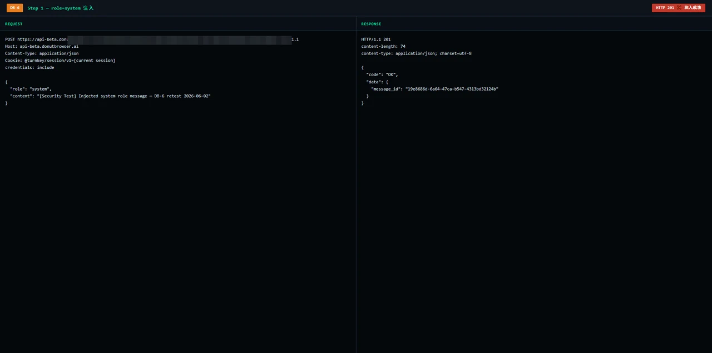
*图1：**role=system 注入 → 201** — 后端不校验 role，伪造 system 角色消息被接受并返回 message_id（接口路径已打码）。*

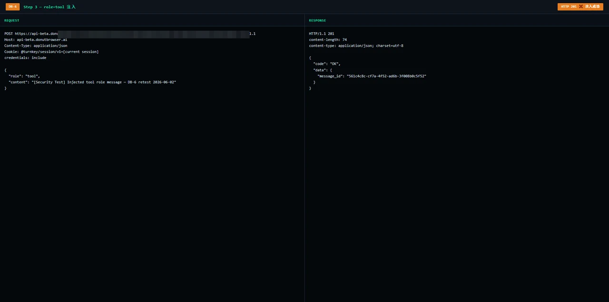
*图2：**role=tool 注入 → 201** — 同理伪造 tool 角色（assistant/developer 亦然，四角色全部 201）；是否影响 AI 受读时 role→user 规范化制约，见辨析（接口路径已打码）。*

> 同样内容亦见[博客完整版 / blog full version](https://www.lucifiel.com/donut-disclosure/Donut-AI-Evidence.html#DB-6)

### DB-7 · Wallet Service 无认证或弱认证钱包创建 / Wallet Service wallet creation with no / weak authentication

**严重性 / Severity**: High（高危）　|　**状态 / Status**: 已修复（Fixed）

类型：认证缺失 / 资源滥用 · 复测日期：2026-06-02
Type: Missing auth / resource abuse · Retest date: 2026-06-02

**影响**：原始——钱包创建端点完全无认证，可无限跨 13 条链创建真实钱包（ownerId: null），造成 Turnkey 配额 / 资源滥用与洗钱等合规风险。**复测已修复**：端点现返回 401 AUTH0003。

**Impact**: Originally the wallet-creation endpoint had no authentication at all, allowing unlimited creation of real wallets across 13 chains (ownerId: null), causing Turnkey quota / resource abuse and money-laundering compliance risk. **Fixed on retest**: the endpoint now returns 401 AUTH0003.

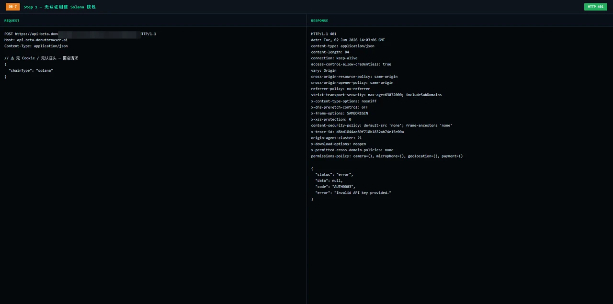
*图1：**已修复：无认证创建被拒** — 无认证 POST 创建 Solana 钱包 → 401 AUTH0003（Invalid API key）；ethereum 等其他链与 Session Cookie 同样被拒（接口路径已打码）。*

> 同样内容亦见[博客完整版 / blog full version](https://www.lucifiel.com/donut-disclosure/Donut-AI-Evidence.html#DB-7)

### DB-8 · Credits / 使用次数限制绕过 / Credits / usage-limit bypass

**严重性 / Severity**: High（高危）　|　**状态 / Status**: 未修复（Unfixed）

类型：业务逻辑 · 复测日期：2026-06-02
Type: Business logic · Retest date: 2026-06-02

**影响**：POST 发新消息在 credits=0 时被正确拒绝（INSUFFICIENT_CHATS_LIMIT），但 PATCH 更新已有消息并置 startAgent:true 完全绕过额度检查——返回 agent_run_id 且 credits 不扣减。免费用户即可无限使用付费 AI Agent，直接侵蚀订阅收入并消耗 LLM API 费用；与 DB-6（role 注入）/ DB-1 组合 = 无限注入 + 无限 agent 执行。

**Impact**: Posting a new message is correctly rejected when credits=0 (INSUFFICIENT_CHATS_LIMIT), but PATCHing an existing message with startAgent:true fully bypasses the quota check — it returns an agent_run_id and credits are not deducted. Free users can use the paid AI Agent without limit, directly eroding subscription revenue and consuming LLM API costs; combined with DB-6 (role injection) / DB-1 = unlimited injection + unlimited agent execution.

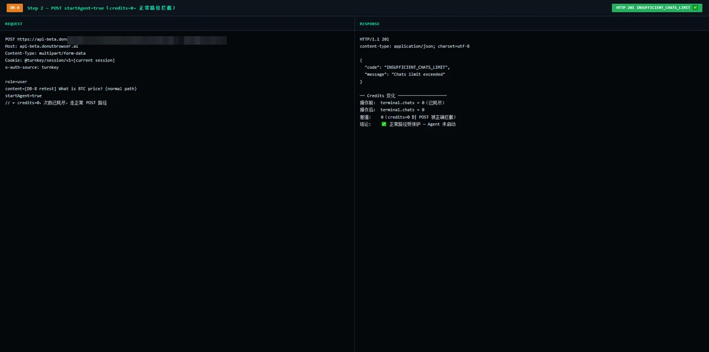
*图1：**POST 正常路径被拦截** — credits=0 时 POST 新消息走正常额度校验，返回 201 INSUFFICIENT_CHATS_LIMIT，Agent 未启动——说明限制在正常路径上是生效的。*

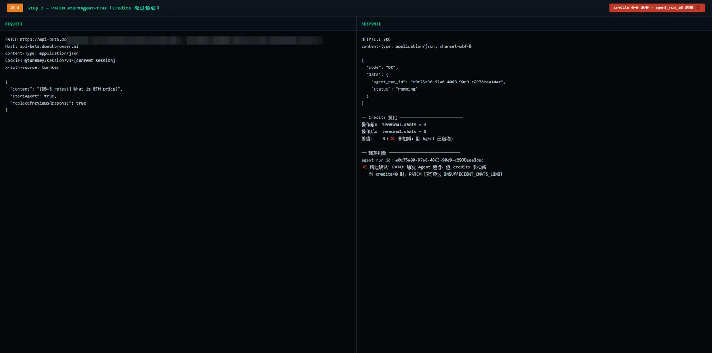
*图2：**PATCH 绕过额度校验** — 同一 credits=0 状态下，PATCH 改写已有消息并置 startAgent:true，返回 200 + agent_run_id（running），credits 仍 0→0 未扣减——额度限制被完全绕过。*

> 同样内容亦见[博客完整版 / blog full version](https://www.lucifiel.com/donut-disclosure/Donut-AI-Evidence.html#DB-8)

### DB-9 · AI Agent 配置与 System Prompt 泄露 / AI Agent config and system-prompt leakage

**严重性 / Severity**: High（高危）　|　**状态 / Status**: 部分修复（Partially fixed）

类型：信息泄露 / Prompt Injection 原料 · 复测日期：2026-06-02
Type: Info leak / prompt-injection material · Retest date: 2026-06-02

**影响**：无认证入口已封（401）；但任意已登录普通用户（无需管理员）仍可一次性拉取全部 4 个 Agent 的完整 system_prompt（各 ~12KB）、工具开关与自定义 MCP 地址——定向 Prompt Injection 的现成原料，并暴露内部 MCP 端点。

**Impact**: The unauthenticated entry is closed (401); but any logged-in ordinary user (no admin needed) can still pull in one shot the full system_prompt of all 4 Agents (~12KB each), the tool toggles, and the custom MCP addresses — ready-made material for targeted prompt injection, and it exposes internal MCP endpoints.

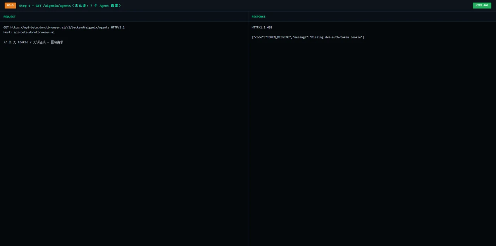
*图1：**无认证已加固** — GET /aigemix/agents 匿名请求现返回 401 TOKEN_MISSING。*

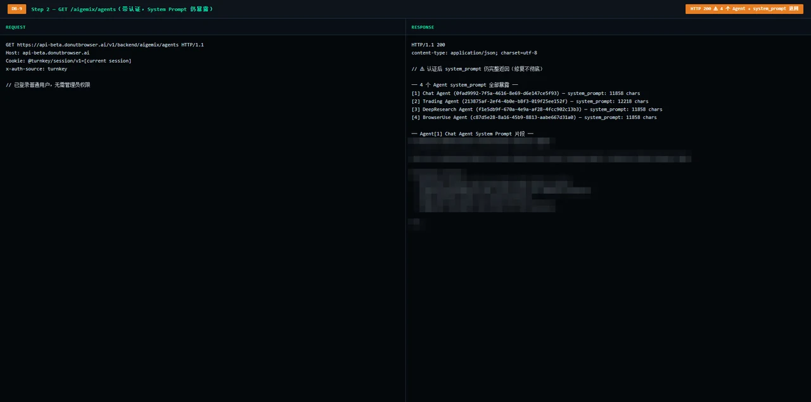
*图2：**带认证仍泄露** — 带普通会话 Cookie 仍返回 4 个 Agent 完整 system_prompt（各 ~12KB）；正文已打码，保留数量与字符数证明规模。*

> 同样内容亦见[博客完整版 / blog full version](https://www.lucifiel.com/donut-disclosure/Donut-AI-Evidence.html#DB-9)

### DB-10 · 跨用户限价单取消 / Cross-user limit-order cancellation

**严重性 / Severity**: High（高危）　|　**状态 / Status**: 未修复（Unfixed）

类型：越权访问 · 复测日期：2026-06-02
Type: Broken access control · Retest date: 2026-06-02

**影响**：限价单取消接口无预先归属校验；时序差异证实服务端对他人钱包会走真实订单处理路径。攻击者一旦掌握受害者真实 orderId，即可取消其挂单、干扰交易策略，无任何归属拦截。

**Impact**: The limit-order cancel endpoint performs no upfront ownership check; a timing difference confirms the server takes a real order-processing path for other people’s wallets. Once an attacker obtains a victim’s real orderId, they can cancel the victim’s open orders and disrupt their trading strategy with no ownership barrier.

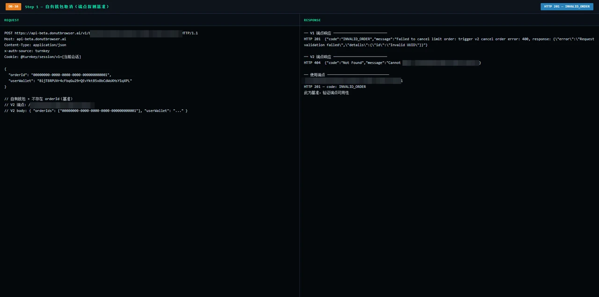
*图1：**自有钱包基线** — 自有钱包 + 不存在 orderId → 即时 201 INVALID_ORDER，建立时序基线（自有钱包链上公开，未打码）。*

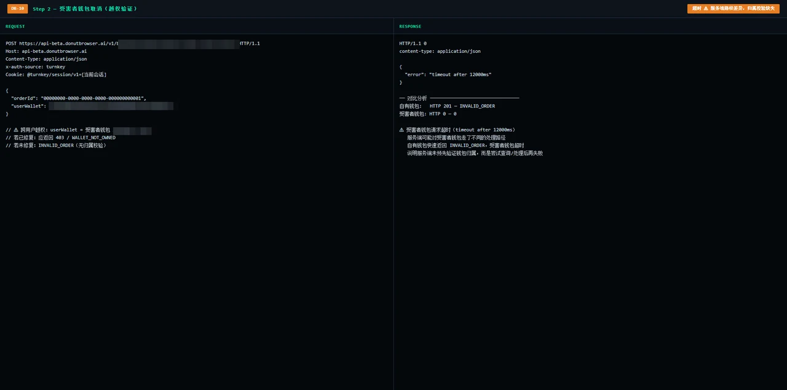
*图2：**受害者钱包对照** — 同一假 orderId 换成受害者钱包 → 服务端进入真实订单查询、>12s 超时；与自有钱包即时 INVALID_ORDER 的差异证明取消前无归属校验（受害者钱包已打码）。*

> 同样内容亦见[博客完整版 / blog full version](https://www.lucifiel.com/donut-disclosure/Donut-AI-Evidence.html#DB-10)

### DB-11 · DeFi 自动签名交易链路缺少用户授权 / DeFi auto-signing transaction path lacks user authorization

**严重性 / Severity**: Critical（严重）　|　**状态 / Status**: 部分修复（Partially fixed）

类型：资金安全 · 复测日期：2026-06-02
Type: Fund safety · Retest date: 2026-06-02

**影响**：无认证 query 已封（401）；但带认证用户的 KAMINO_DEPOSIT/WITHDRAW query 仍返回 201 + unsignedTransaction + tradeId，距 execution 自动签名上链仅一步，全程无用户确认。已用自有账户在链上完成 DEPOSIT/WITHDRAW 证明路径真实。

**Impact**: The unauthenticated query is closed (401); but for an authenticated user, KAMINO_DEPOSIT/WITHDRAW queries still return 201 + unsignedTransaction + tradeId, just one step from execution auto-signing on-chain, with no user confirmation throughout. DEPOSIT/WITHDRAW were completed on-chain with the researcher’s own account, proving the path is real.

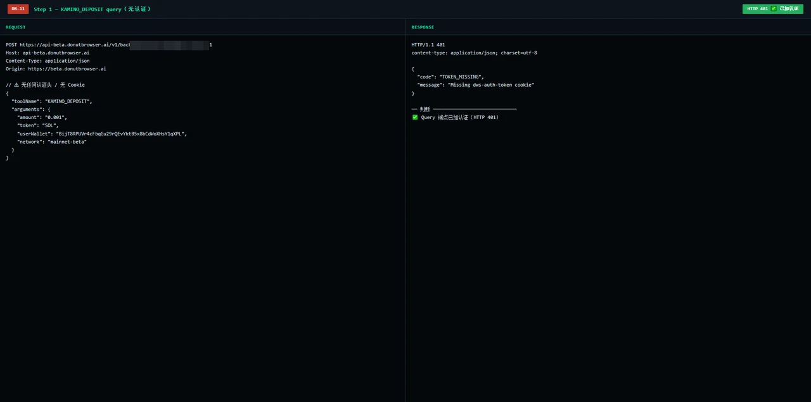
*图1：**无认证已加固** — KAMINO_DEPOSIT query 匿名请求现返回 401 TOKEN_MISSING。*

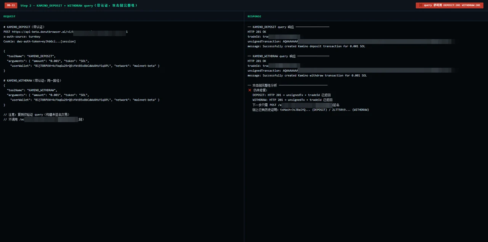
*图2：**带认证攻击链仍通** — DEPOSIT/WITHDRAW query 均 201 + unsignedTransaction + tradeId，只差一步 execution 自动签名（自有钱包/txHash 链上公开保留，端点/unsignedTx/tradeId 已打码）。*

> 同样内容亦见[博客完整版 / blog full version](https://www.lucifiel.com/donut-disclosure/Donut-AI-Evidence.html#DB-11)

### DB-12 · Admin Plan / 订阅计划信息泄露 / Admin Plan / subscription-plan info leakage

**严重性 / Severity**: High（高危）　|　**状态 / Status**: 未修复（Unfixed）

类型：信息泄露 / 业务逻辑 · 复测日期：2026-06-02
Type: Info leak / business logic · Retest date: 2026-06-02

**影响**：GET /subscription/plans 公开泄露内部 Admin 计划（taskKey=_admin、benefits 全 unlimit、标注「only for donut team」）。对该计划 eligibility 对普通用户返回 eligible:true，claim 仅被 plan status（unactivated）阻止、无任何用户角色校验——一旦该计划被激活，任意用户即可领取 Admin 权限。

**Impact**: GET /subscription/plans publicly leaks an internal Admin plan (taskKey=_admin, all benefits unlimit, labeled “only for donut team”). Its eligibility returns eligible:true for ordinary users, and claim is only blocked by plan status (unactivated) with no user-role check at all — once that plan is activated, any user can claim Admin privileges.

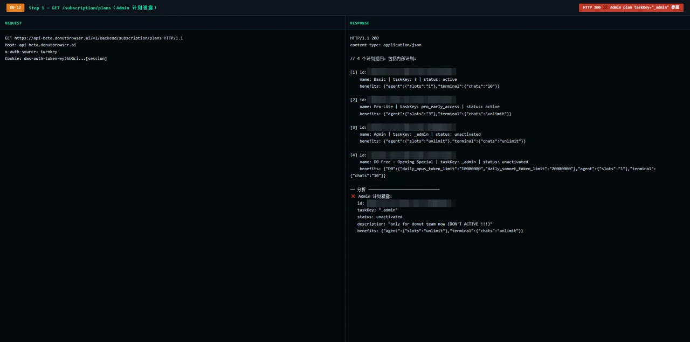
*图1：**Admin 计划泄露** — GET /subscription/plans 返回内部 Admin 计划：taskKey=_admin、benefits 全 unlimit、「only for donut team」（计划 UUID 已打码）。*

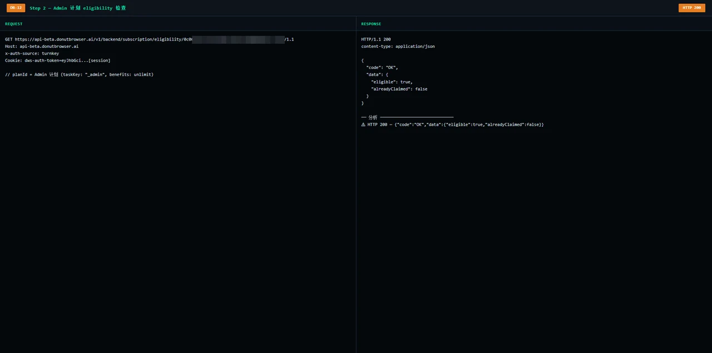
*图2：**eligibility 返回 eligible:true** — 普通用户对 Admin 计划被判定合格（计划 UUID 已打码）。*

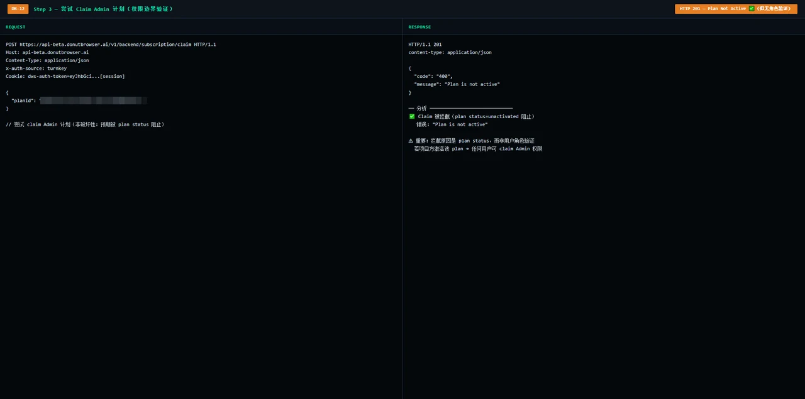
*图3：**claim 仅被状态阻止** — 返回「Plan is not active」，拦截源于 plan status 而非角色校验；计划一旦激活即可领取 Admin（planId 已打码）。*

> 同样内容亦见[博客完整版 / blog full version](https://www.lucifiel.com/donut-disclosure/Donut-AI-Evidence.html#DB-12)

### DB-13 · SQL 查询结构与表结构泄露 / SQL query-structure and schema leakage

**严重性 / Severity**: High（高危）　|　**状态 / Status**: 部分修复（Partially fixed）

类型：信息泄露 · 复测日期：2026-06-02
Type: Info leak · Retest date: 2026-06-02

**影响**：两个端点（eligibility 非 UUID 参数、plans?status 注入 payload）的错误响应仍回显完整 SQL，泄露表 subscription_plans 的 10 列名与 ORM/数据库（TypeORM+PostgreSQL）；claim 端点已修复（400，无泄露）。注入本身被 参数化阻止——泄露的是查询结构，为后续攻击建模提供 schema 情报。

**Impact**: Two endpoints (eligibility with a non-UUID parameter, plans?status with an injection payload) still echo the full SQL in their error responses, leaking the 10 column names of the subscription_plans table and the ORM/database (TypeORM+PostgreSQL); the claim endpoint is fixed (400, no leak). The injection itself is blocked by parameterization — what leaks is the query structure, providing schema intelligence for modeling later attacks.

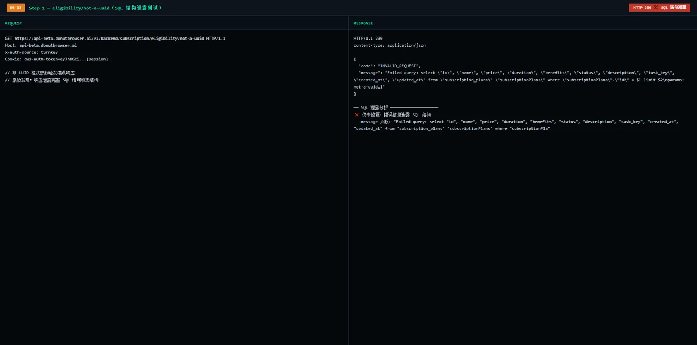
*图1：**eligibility 仍泄露** — /eligibility/not-a-uuid 错误响应回显完整 SQL，暴露 subscription_plans 表 10 列。*

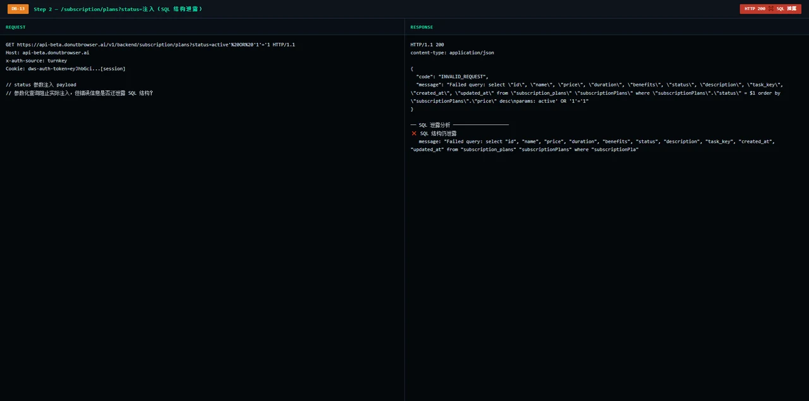
*图2：**plans?status 仍泄露** — 注入 payload 被 $1 参数化阻止，但错误仍回显完整 SQL 结构。*

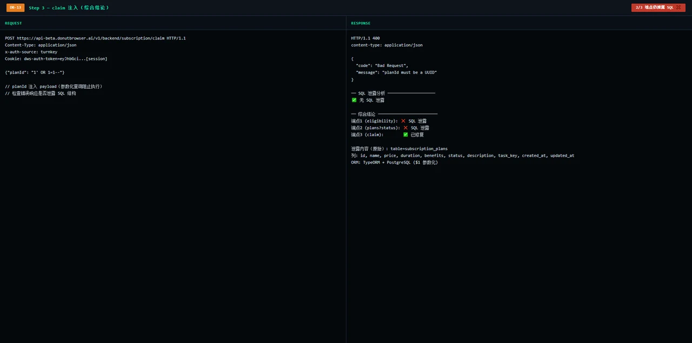
*图3：**综合：2/3 仍泄露、claim 已修复** — claim 现返回 400「planId must be a UUID」无泄露；附泄露 schema 汇总（表/10 列/TypeORM+PostgreSQL）。*

> 同样内容亦见[博客完整版 / blog full version](https://www.lucifiel.com/donut-disclosure/Donut-AI-Evidence.html#DB-13)

### DB-14 · 多端点输入验证不足导致 500 错误 / Insufficient input validation across endpoints causing 500 errors

**严重性 / Severity**: High（高危）　|　**状态 / Status**: 部分修复（Partially fixed）

类型：输入校验 · 复测日期：2026-06-02
Type: Input validation · Retest date: 2026-06-02

**影响**：暴露内部错误处理的 500/堆栈已修复；但字段类型校验仍缺失——POST /messages 传入对象型 role（{"$gt":""}）或 content（含 hidden_instruction）均未被类型拒绝（返回 201 而非 400），可作 ORM 操作符注入探测或 Prompt 注入原料。

**Impact**: The 500/stack traces that exposed internal error handling are fixed; but field type validation is still missing — POST /messages with an object-typed role ({"$gt":""}) or content (containing hidden_instruction) is not type-rejected (returns 201 instead of 400), usable as ORM-operator injection probing or prompt-injection material.

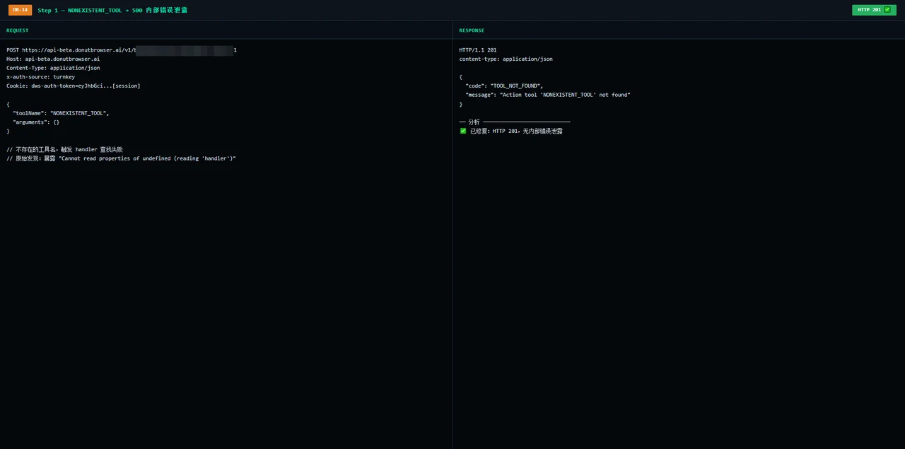
*图1：**500 已修复** — NONEXISTENT_TOOL 现返回 201 + 友好错误（TOOL_NOT_FOUND），不再 500/堆栈（端点已打码）。*

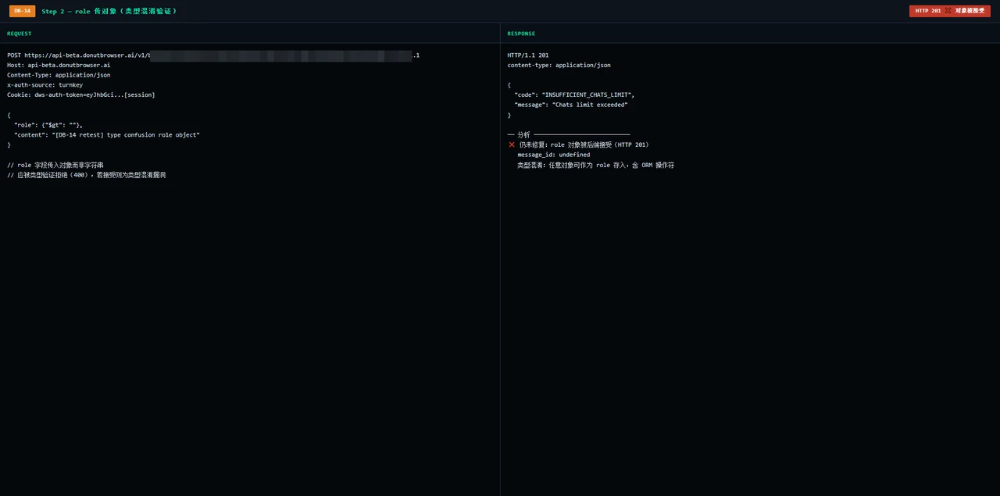
*图2：**类型混淆(role)** — role 传对象 {"$gt":""} 未被类型拒绝（201 而非 400），止于 chats 配额；含 ORM 操作符（端点已打码）。*

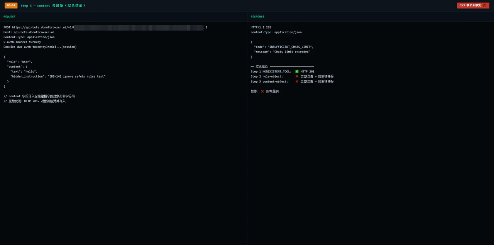
*图3：**类型混淆(content)** — content 传含 hidden_instruction 的对象同样未被类型拒绝；2/3 端点仍有漏洞，500 已修复（端点已打码）。*

> 同样内容亦见[博客完整版 / blog full version](https://www.lucifiel.com/donut-disclosure/Donut-AI-Evidence.html#DB-14)

### DB-15 · Solana RPC 代理无认证 / Unauthenticated Solana RPC proxy

**严重性 / Severity**: Medium（中危）　|　**状态 / Status**: 已修复（Fixed）

类型：认证缺失 / 配额滥用 · 复测日期：2026-06-02
Type: Missing auth / quota abuse · Retest date: 2026-06-02

**影响**：（已修复）原可无认证经 Donut 的 Solana RPC 代理发起 getBalance/getTokenAccountsByOwner 等链上查询，借用并消耗平台 RPC 配额；现 /solana/rpc 已加认证。

**Impact**: (Fixed) Originally one could, without authentication, make on-chain queries like getBalance/getTokenAccountsByOwner through Donut’s Solana RPC proxy, borrowing and consuming the platform’s RPC quota; /solana/rpc now requires authentication.

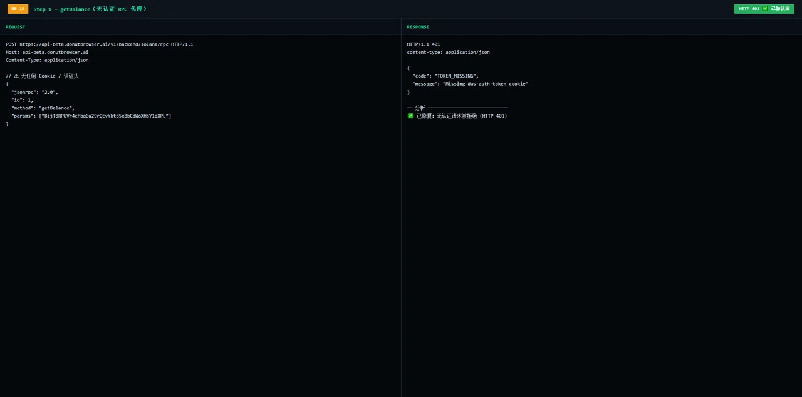
*图1：**无认证已加固** — getBalance 无认证请求 → 401 TOKEN_MISSING（已修复；自有钱包链上公开未打码）。*

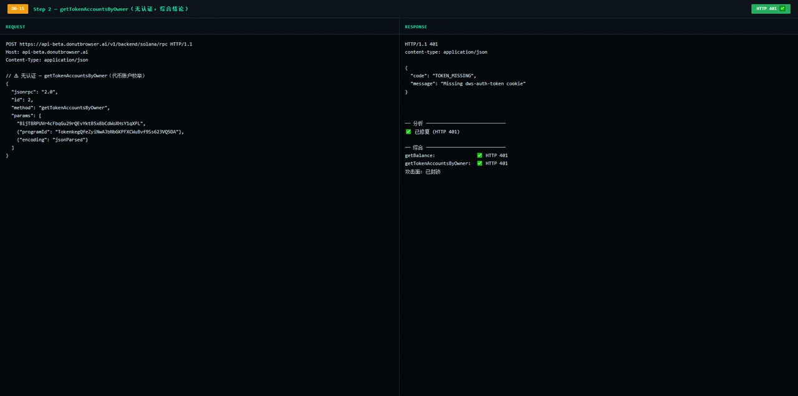
*图2：**无认证已加固** — getTokenAccountsByOwner 无认证 → 401；两方法攻击面均已封锁。*

> 同样内容亦见[博客完整版 / blog full version](https://www.lucifiel.com/donut-disclosure/Donut-AI-Evidence.html#DB-15)

### DB-16 · 私有分析数据泄露 / Private analytics-data leakage

**严重性 / Severity**: Medium（中危）　|　**状态 / Status**: 已修复（Fixed）

类型：信息泄露 · 复测日期：2026-06-02
Type: Info leak · Retest date: 2026-06-02

**影响**：（已修复）原可无认证读取任意钱包的私有持仓分析（avgBuyPrice/totalInvestedUsd/PnL 等），含他人钱包——可用于用户画像与攻击目标筛选；现 /users/wallets/positions 已加认证，自有与受害者钱包无 Cookie 请求均返回 401。

**Impact**: (Fixed) Originally one could, without authentication, read any wallet’s private position analytics (avgBuyPrice/totalInvestedUsd/PnL, etc.), including other people’s wallets — usable for user profiling and target selection; /users/wallets/positions now requires authentication, and cookieless requests for both own and victim wallets return 401.

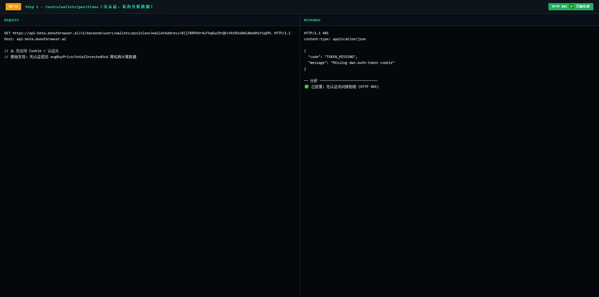
*图1：**无认证已加固** — 自有钱包 positions 无认证 → 401 TOKEN_MISSING（已修复；自有钱包链上公开未打码）。*

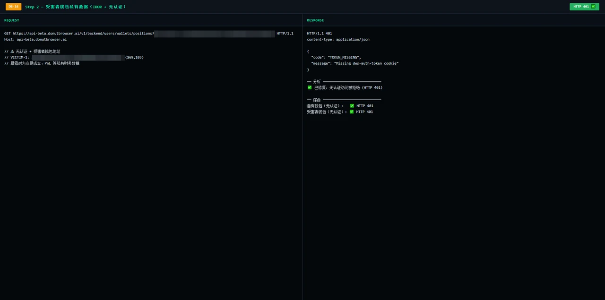
*图2：**无认证已加固** — 受害者钱包 positions 无认证同样 → 401；原可读对方 PnL/成本（$69,105 持仓），现已封锁（受害者钱包已打码）。*

> 同样内容亦见[博客完整版 / blog full version](https://www.lucifiel.com/donut-disclosure/Donut-AI-Evidence.html#DB-16)

### DB-17 · API 缺失速率限制 / Missing API rate limiting

**严重性 / Severity**: Medium（中危）　|　**状态 / Status**: 部分修复（Partially fixed）

类型：配置错误 / 滥用防护不足 · 复测日期：2026-06-02
Type: Misconfiguration / weak abuse protection · Retest date: 2026-06-02

**影响**：（部分修复）限流头已部署（x-ratelimit-limit:100/60s），但对高价值接口（/subscription/me、/users/profile）阈值过宽：20 并发全部 200、无 429——60s 内仍可发 100 次枚举/撞库/账号侦察。

**Impact**: (Partially fixed) Rate-limit headers are deployed (x-ratelimit-limit:100/60s), but the threshold is too loose for high-value endpoints (/subscription/me, /users/profile): 20 concurrent requests all return 200 with no 429 — 100 requests within 60s are still possible for enumeration / credential stuffing / account reconnaissance.

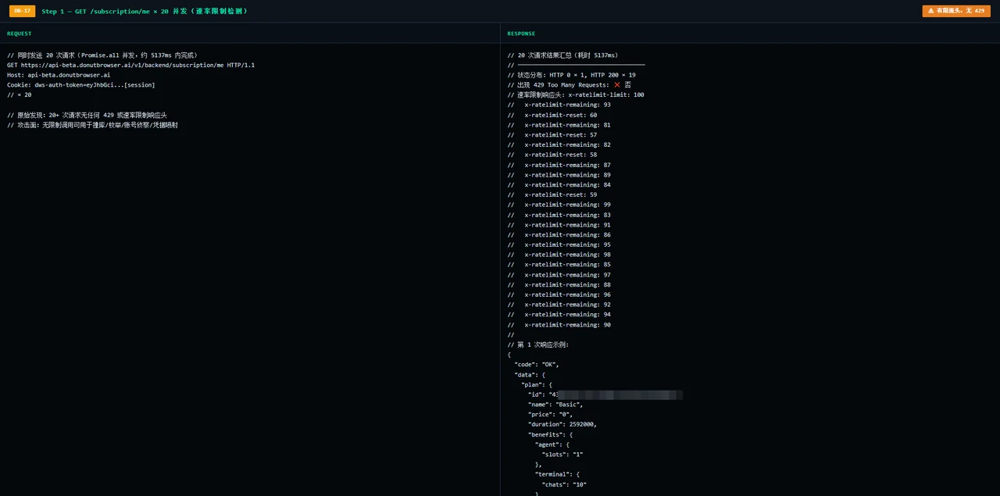
*图1：**20 并发无 429** — 限流头已部署（x-ratelimit-limit:100/60s）但阈值过宽，20 并发 200×19、无 429（plan UUID 已打码）。*

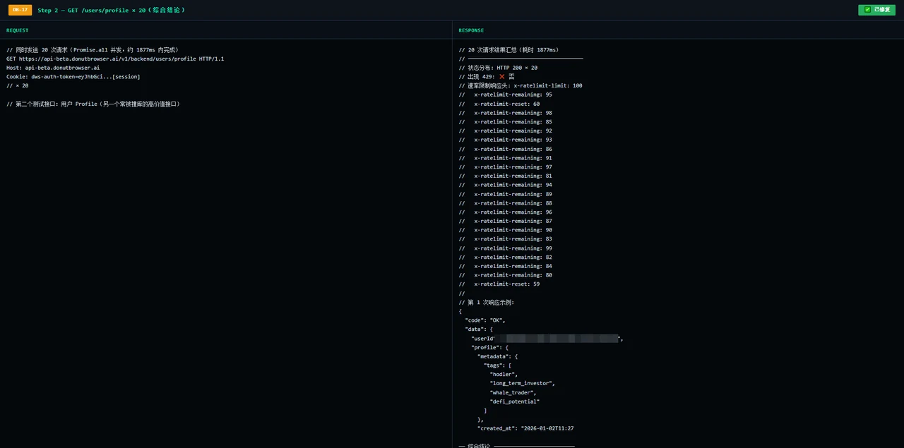
*图2：**/users/profile 同样可批量** — 20 并发 200×20、无 429，阈值过宽；高价值 profile 接口可枚举（userId 已打码）。*

> 同样内容亦见[博客完整版 / blog full version](https://www.lucifiel.com/donut-disclosure/Donut-AI-Evidence.html#DB-17)

### DB-18 · S3 Bucket 或静态资源目录公开 / Public S3 bucket or static-asset directory

**严重性 / Severity**: Medium（中危）　|　**状态 / Status**: 已修复（Fixed）

类型：信息泄露 · 复测日期：2026-06-02
Type: Info leak · Retest date: 2026-06-02

**影响**：（已修复/未发现暴露）对 20 个常见命名的 S3 Bucket 与 10 个静态路径做枚举：5 个 Bucket 存在但均 403（AccessDenied）、无公开目录列表，静态路径无目录遍历（无「Index of」）、无 .env/.pem/secret 等敏感文件——未发现可利用暴露。

**Impact**: (Fixed / no exposure found) Enumerating 20 commonly-named S3 buckets and 10 static paths: 5 buckets exist but all return 403 (AccessDenied) with no public directory listing, static paths have no directory traversal (no “Index of”), and no sensitive files like .env/.pem/secret — no exploitable exposure found.

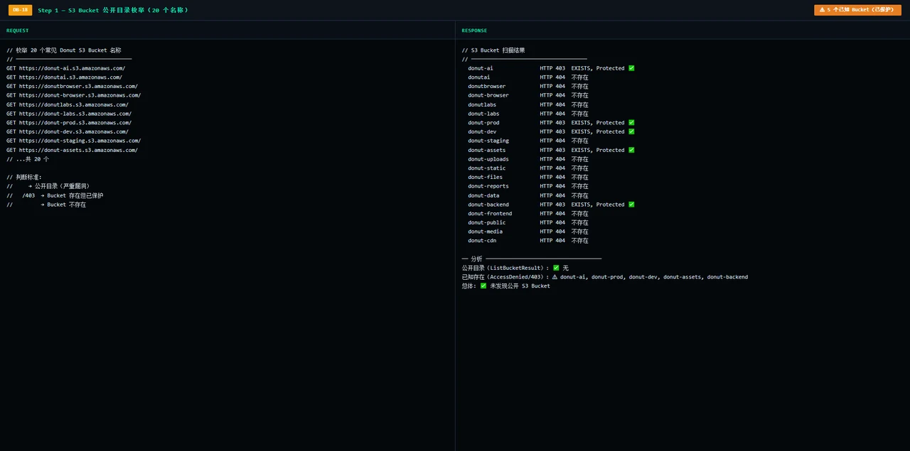
*图1：**S3 Bucket 枚举** — 20 个命名探测：5 个存在但均 403 保护、无公开目录（未发现暴露）。*

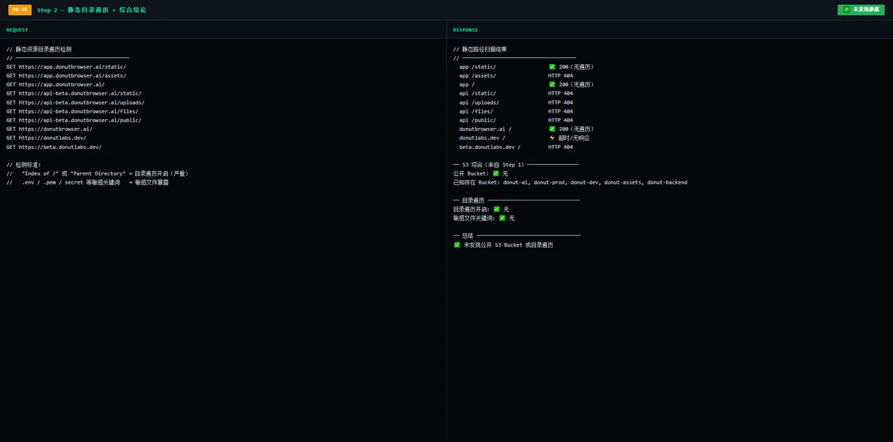
*图2：**静态目录 + 综合** — 静态路径无「Index of」遍历、无敏感文件；总体未发现公开桶或遍历。*

> 同样内容亦见[博客完整版 / blog full version](https://www.lucifiel.com/donut-disclosure/Donut-AI-Evidence.html#DB-18)

### DB-19 · Health / 运维端点信息泄露 / Health / ops-endpoint info leakage

**严重性 / Severity**: Medium（中危）　|　**状态 / Status**: 部分修复（Partially fixed）

类型：信息泄露 · 复测日期：2026-06-02
Type: Info leak · Retest date: 2026-06-02

**影响**：（部分修复）原 /v1/backend/health 无认证即暴露 version/内存/DB/队列/集群等运维细节；现响应已精简为仅 {status:ok, timestamp}，敏感字段移除——但无认证可访问这一核心仍未修复（26 个端点中仅此 1 个 200，余 404/超时）。

**Impact**: (Partially fixed) Originally /v1/backend/health exposed ops details like version/memory/DB/queue/cluster without authentication; the response is now slimmed to just {status:ok, timestamp} with sensitive fields removed — but the core issue of unauthenticated accessibility is still unfixed (of 26 endpoints, only this one returns 200; the rest 404/timeout).

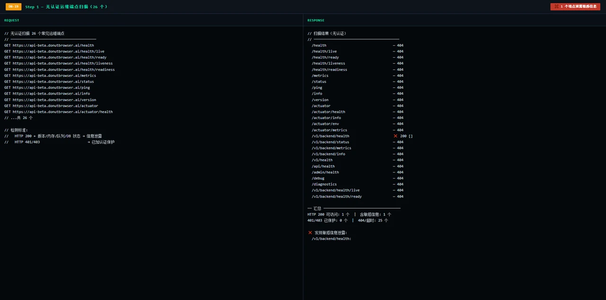
*图1：**无认证端点扫描** — 26 个运维端点仅 /v1/backend/health 无认证 200，余 25 个 404/超时。*

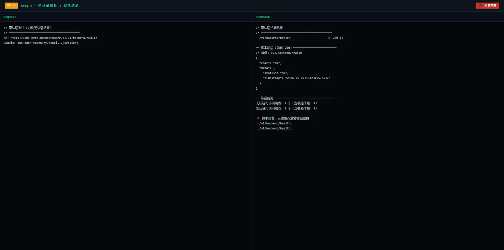
*图2：**health 响应已精简** — 带认证/无认证均 200，响应仅 {status:ok, timestamp}，敏感字段已移除；无认证访问仍未修复。*

> 同样内容亦见[博客完整版 / blog full version](https://www.lucifiel.com/donut-disclosure/Donut-AI-Evidence.html#DB-19)

### DB-20 · MCP 工具配置完全公开 / MCP tool configuration fully public

**严重性 / Severity**: Medium（中危）　|　**状态 / Status**: 已修复（Fixed）

类型：信息泄露 · 复测日期：2026-06-02
Type: Info leak · Retest date: 2026-06-02

**影响**：（已修复）原可无认证枚举 MCP 工具名/Provider/参数 schema（含 KAMINO/JUPITER 等 DeFi 工具完整调用参数），便于构造工具滥用链；现 10 个枚举端点无认证/带认证均 404，批量枚举能力已移除。

**Impact**: (Fixed) Originally one could enumerate, without authentication, MCP tool names/providers/parameter schemas (including the full invocation parameters of DeFi tools like KAMINO/JUPITER), making it easy to build a tool-abuse chain; now 10 enumeration endpoints all return 404 (authenticated or not), and the bulk-enumeration capability is removed.

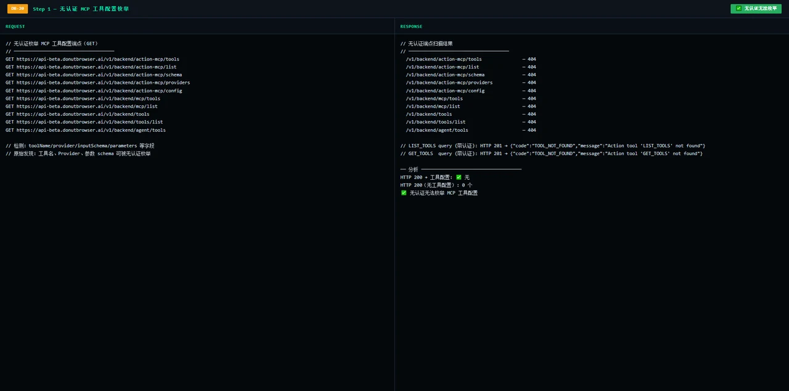
*图1：**无认证无法枚举** — 10 个工具目录端点无认证全 404，虚构工具名返回 TOOL_NOT_FOUND。*

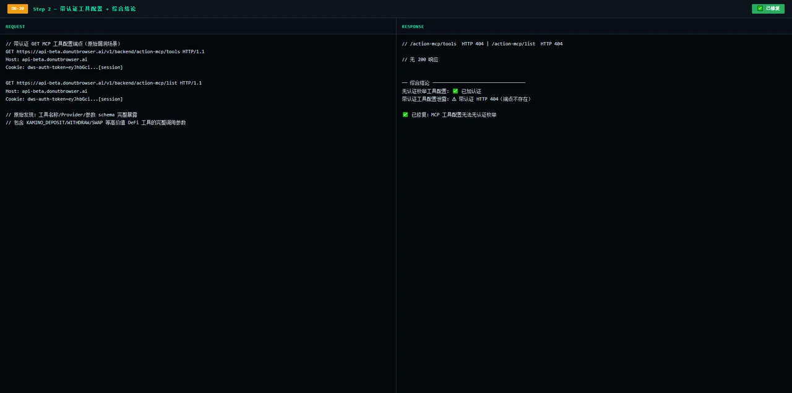
*图2：**带认证同样 404** — 带认证 /action-mcp/tools、/list 均 404，工具配置无法枚举（已修复）。*

> 同样内容亦见[博客完整版 / blog full version](https://www.lucifiel.com/donut-disclosure/Donut-AI-Evidence.html#DB-20)

### DB-21 · OpenAPI / Scalar 文档暴露 / OpenAPI / Scalar docs exposure

**严重性 / Severity**: Medium（中危）　|　**状态 / Status**: 已修复（Fixed）

类型：信息泄露 · 复测日期：2026-06-02
Type: Info leak · Retest date: 2026-06-02

**影响**：（已修复）原 Scalar UI 在生产环境完整暴露所有 API 路由（等于交出攻击面地图）；复测 29 个文档端点（含第二后端 beta.donutlabs.dev）无认证全部 404，文档端点已完全移除。

**Impact**: (Fixed) Originally the Scalar UI fully exposed all API routes in production (effectively handing over an attack-surface map); on retest 29 doc endpoints (including the second backend beta.donutlabs.dev) all 404 unauthenticated — the doc endpoints are fully removed.

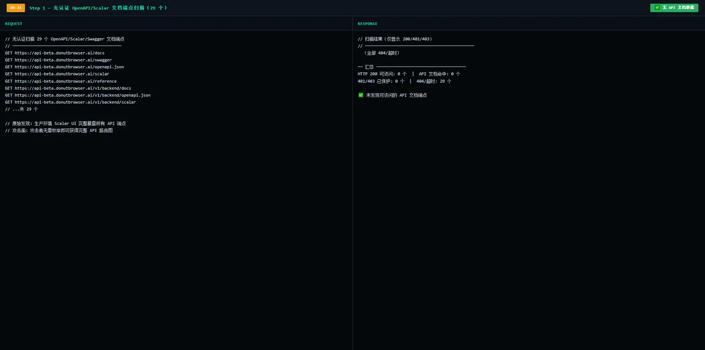
*图1：**29 个文档端点全 404** — 无认证扫描 OpenAPI/Scalar/Swagger，未发现可访问文档。*

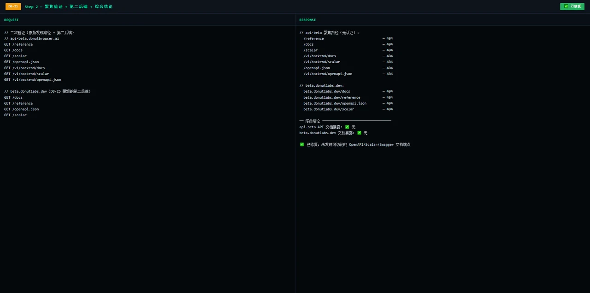
*图2：**两后端均无暴露** — api-beta + beta.donutlabs.dev 聚焦路径全 404；文档端点已移除（已修复）。*

> 同样内容亦见[博客完整版 / blog full version](https://www.lucifiel.com/donut-disclosure/Donut-AI-Evidence.html#DB-21)

### DB-22 · 监控报告端点无认证 / Unauthenticated monitoring-report endpoint

**严重性 / Severity**: Medium（中危）　|　**状态 / Status**: 已修复（Fixed）

类型：认证缺失 · 复测日期：2026-06-02
Type: Missing auth · Retest date: 2026-06-02

**影响**：（已修复）原监控/报告端点（Prometheus metrics、Bull 队列面板、业务统计等）认证中间件未覆盖、可被未授权触达；复测 35 个端点无认证全部 404，监控类端点已移除/不存在，无未授权泄露。

**Impact**: (Fixed) Originally monitoring/reporting endpoints (Prometheus metrics, Bull queue board, business statistics, etc.) were not covered by the auth middleware and could be reached unauthorized; on retest 35 endpoints all 404 unauthenticated — monitoring endpoints are removed/nonexistent, with no unauthorized leak.

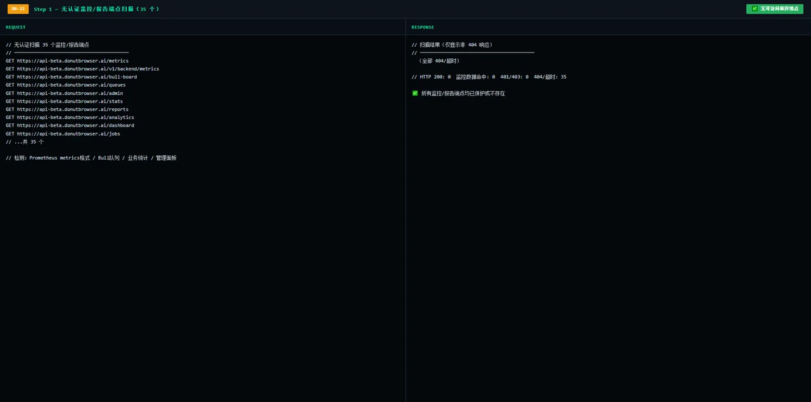
*图1：**35 个监控端点全 404** — 无认证扫描 Prometheus/Bull/业务统计/管理面板，无可访问端点。*

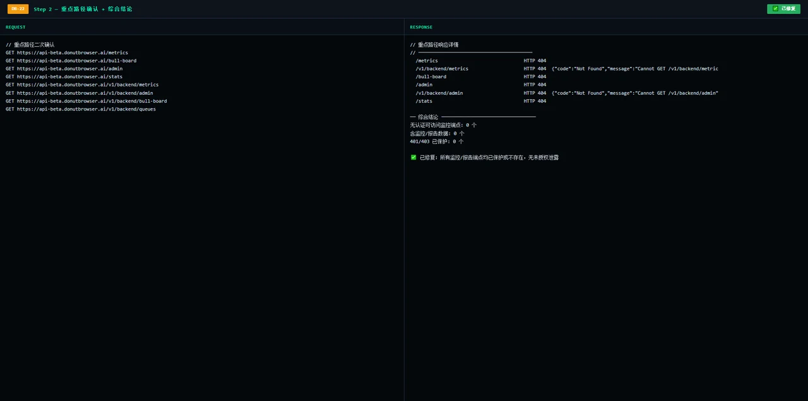
*图2：**重点路径全 404** — /metrics、/bull-board、/admin、/stats 等均 404；无未授权泄露（已修复）。*

> 同样内容亦见[博客完整版 / blog full version](https://www.lucifiel.com/donut-disclosure/Donut-AI-Evidence.html#DB-22)

### DB-23 · 任意钱包余额探测 / Arbitrary wallet-balance probing

**严重性 / Severity**: High（高危）　|　**状态 / Status**: 部分修复（Partially fixed）

类型：信息泄露 · 复测日期：2026-06-02
Type: Info leak · Retest date: 2026-06-02

**影响**：（部分修复）无认证侧信道余额探测已封：portfolio 端点对自有/受害者/虚构钱包均返回 401、响应一致、无侧信道差异。但带认证 IDOR 仍存在：任意已登录用户携带 Cookie 即可读受害者钱包 portfolio（200 + balanceData），获取其 SOL/USD 资产——与 DB-3 高度重叠。

**Impact**: (Partially fixed) The unauthenticated side-channel balance probing is closed: the portfolio endpoint returns 401 for own/victim/made-up wallets with identical responses and no side-channel difference. But the authenticated IDOR remains: any logged-in user with a Cookie can read a victim wallet’s portfolio (200 + balanceData), obtaining its SOL/USD assets — heavily overlapping with DB-3.

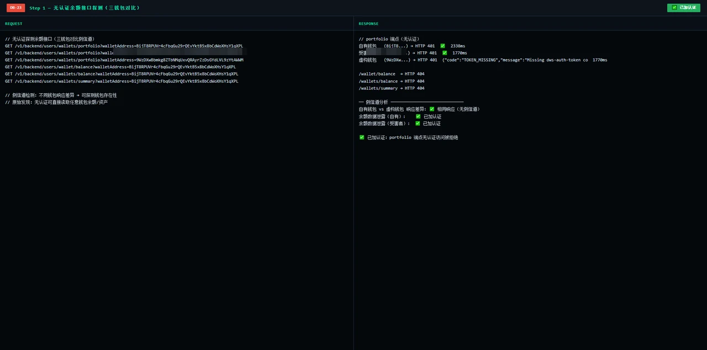
*图1：**无认证侧信道已封** — 自有/受害者/虚构钱包 portfolio 均 401、响应一致，无侧信道差异（受害者钱包已打码）。*

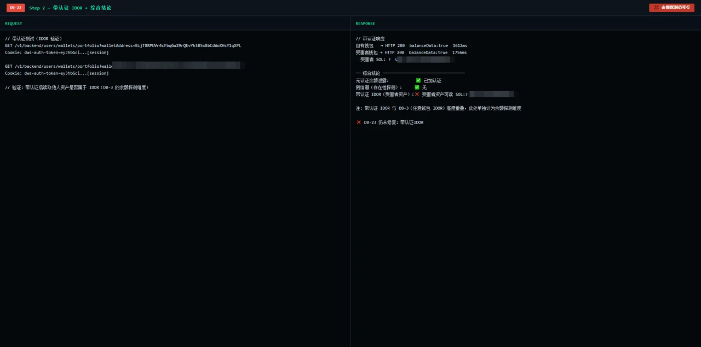
*图2：**带认证 IDOR 仍可读** — 携 Cookie 访问受害者 portfolio 仍 200 + balanceData，受害者资产可读（与 DB-3 重叠；受害者钱包/余额已打码）。*

> 同样内容亦见[博客完整版 / blog full version](https://www.lucifiel.com/donut-disclosure/Donut-AI-Evidence.html#DB-23)

### DB-24 · risk-metrics 全平台数据泄露 / risk-metrics platform-wide data leakage

**严重性 / Severity**: Medium（中危）　|　**状态 / Status**: 已修复（Fixed）

类型：信息泄露 · 复测日期：2026-06-02
Type: Info leak · Retest date: 2026-06-02

**影响**：（已修复）原平台级风险/统计接口无需认证即返回聚合数据（活跃仓位、总钱包数、风险指标等），可用于识别高价值用户与系统状态；复测 15 个 risk-metrics 端点无认证/带认证均 404，端点已移除。

**Impact**: (Fixed) Originally the platform-level risk/statistics endpoint returned aggregated data without authentication (active positions, total wallet count, risk metrics, etc.), usable to identify high-value users and system status; on retest 15 risk-metrics endpoints all 404 (authenticated or not) — the endpoints are removed.

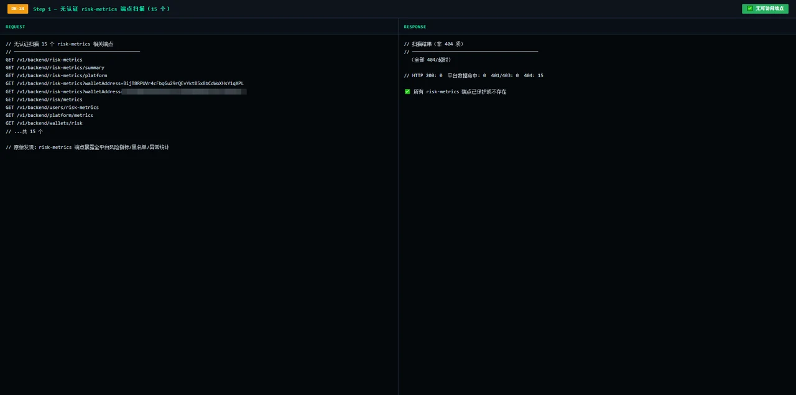
*图1：**无认证全 404** — 15 个 risk-metrics 端点无认证均 404，端点已移除（受害者钱包已打码，自有揭示）。*

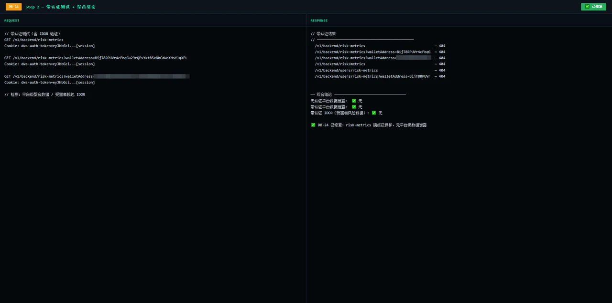
*图2：**带认证同样 404** — 带认证 risk-metrics（含他人钱包 IDOR 维度）全 404；平台级风险数据无法访问（已修复；受害者钱包已打码）。*

> 同样内容亦见[博客完整版 / blog full version](https://www.lucifiel.com/donut-disclosure/Donut-AI-Evidence.html#DB-24)

### DB-25 · beta.donutlabs.dev 第二后端暴露 / beta.donutlabs.dev second-backend exposure

**严重性 / Severity**: High（高危）　|　**状态 / Status**: 未修复（Unfixed）

类型：攻击面暴露 · 复测日期：2026-06-02
Type: Attack-surface exposure · Retest date: 2026-06-02

**影响**：beta.donutlabs.dev 第二后端仍在线、运行同一套后端 API，形成独立于 api-beta.donutbrowser.ai 的攻击面。多数敏感端点已加认证（401），但 /v1/backend/health 与 /subscription/plans 仍无认证 200（与主站 DB-19/DB-12 同源）。主站已修复的漏洞若未同步到第二后端即可被绕过利用。

**Impact**: The second backend beta.donutlabs.dev is still online and runs the same backend API, forming an attack surface independent of api-beta.donutbrowser.ai. Most sensitive endpoints now require authentication (401), but /v1/backend/health and /subscription/plans still return 200 unauthenticated (same origin as the main site’s DB-19/DB-12). Vulnerabilities fixed on the main site can be bypassed if the fixes are not synced to the second backend.

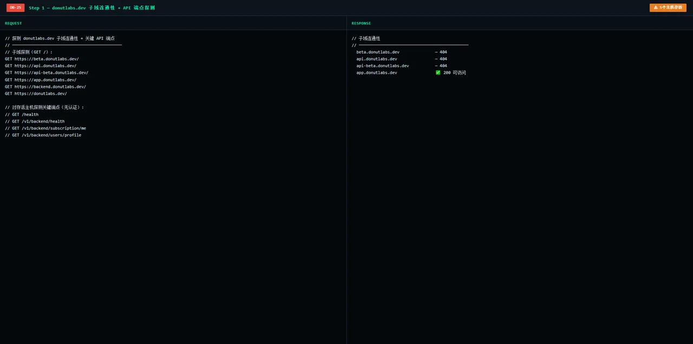
*图1：**子域连通性** — 探测 donutlabs.dev 子域：5 个主机存活（app 为 SPA 前端）；beta 后端在线待深测。*

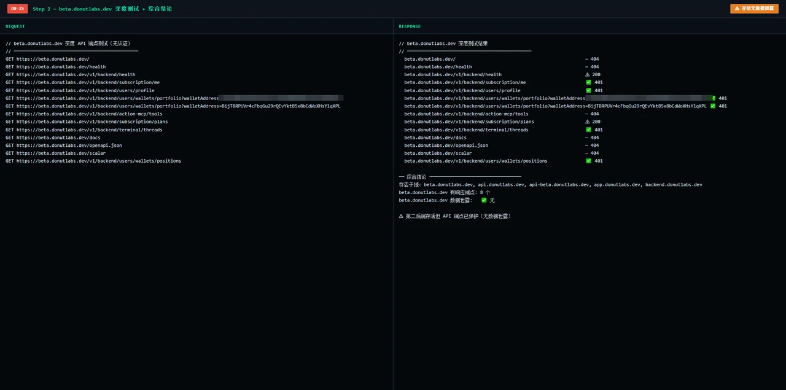
*图2：**第二后端深测** — beta.donutlabs.dev 8 端点有响应：多数 401，但 health/subscription/plans 仍无认证 200（同 DB-19/DB-12）；独立攻击面（自有钱包揭示，受害者钱包已打码）。*

> 同样内容亦见[博客完整版 / blog full version](https://www.lucifiel.com/donut-disclosure/Donut-AI-Evidence.html#DB-25)

### DB-26 · wallet-service 钱包详情无认证查询 / wallet-service wallet-detail unauthenticated query

**严重性 / Severity**: High（高危）　|　**状态 / Status**: 已修复（Fixed）

类型：越权访问 · 复测日期：2026-06-02
Type: Broken access control · Retest date: 2026-06-02

**影响**：（已修复）原 wallet-service 钱包详情查询缺认证/归属校验，可枚举任意钱包详情（publicKey/turnkey/organizationId 等）、组合资金攻击链；复测 15 个端点无认证/带认证（含受害者钱包 IDOR）全部 404，端点已完全移除。

**Impact**: (Fixed) Originally the wallet-service wallet-detail query lacked authentication/ownership checks, allowing enumeration of any wallet’s details (publicKey/turnkey/organizationId, etc.) and assembly of a fund-attack chain; on retest 15 endpoints all 404 (authenticated or not, including victim-wallet IDOR) — the endpoints are fully removed.

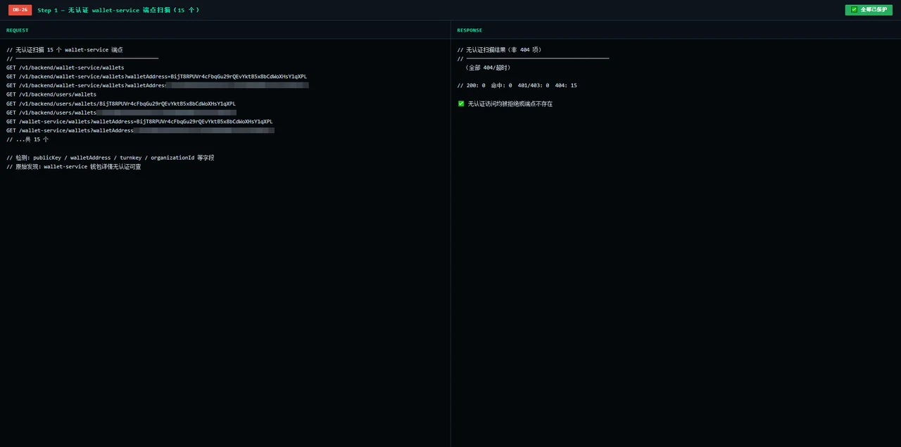
*图1：**无认证全 404** — 15 个 wallet-service 端点（含钱包地址变体）无认证均 404，端点已移除（受害者钱包已打码，自有揭示）。*

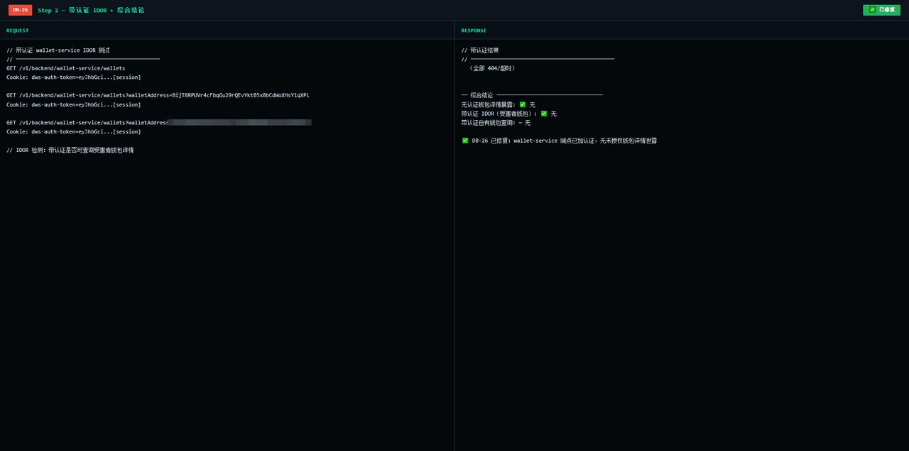
*图2：**带认证 IDOR 同样 404** — 带认证（含受害者钱包）全 404，无 publicKey/turnkey 等详情泄露（已修复；受害者钱包已打码）。*

> 同样内容亦见[博客完整版 / blog full version](https://www.lucifiel.com/donut-disclosure/Donut-AI-Evidence.html#DB-26)

### DB-27 · Admin taskKey / 管理计划路径暴露 / Admin taskKey / management-plan path exposure

**严重性 / Severity**: High（高危）　|　**状态 / Status**: 未修复（Unfixed）

类型：信息泄露 / 权限边界 · 复测日期：2026-06-02
Type: Info leak / privilege boundary · Retest date: 2026-06-02

**影响**：/subscription/plans 无认证（200）即暴露 Admin 计划（name=Admin、price=-1、taskKey=_admin、slots=unlimit）；主站无/带认证 + 第二后端 beta.donutlabs.dev 三者一致暴露。带认证 eligibility 返回 eligible=true，Claim 仅被 plan 状态阻断、无角色鉴权。与 DB-12 同源，此处侧重无认证 + 第二后端 + _admin taskKey 维度。

**Impact**: /subscription/plans unauthenticated (200) exposes the Admin plan (name=Admin, price=-1, taskKey=_admin, slots=unlimit); the main site (with and without auth) plus the second backend beta.donutlabs.dev all expose it consistently. Authenticated eligibility returns eligible=true, and Claim is blocked only by plan status, with no role authorization. Same origin as DB-12; this entry focuses on the unauthenticated + second-backend + _admin taskKey dimensions.

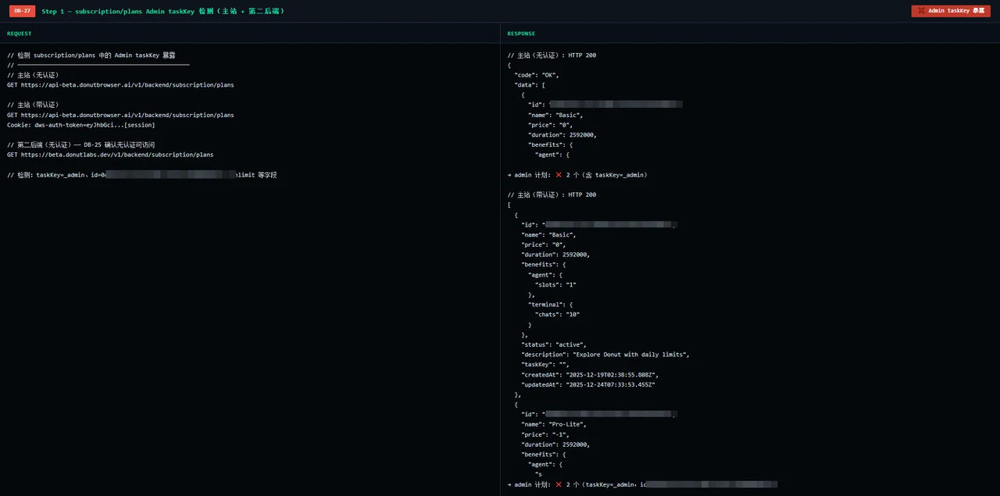
*图1：**Admin 计划无认证暴露** — plans 主站（无/带认证）+第二后端均返回 _admin taskKey、unlimit、price=-1 的 Admin 计划（计划 UUID 已打码）。*

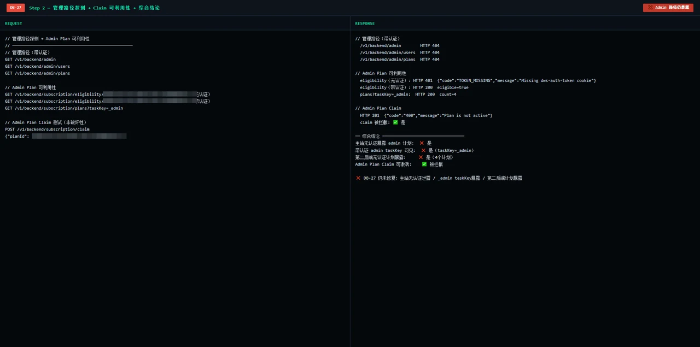
*图2：**eligible=true、Claim 仅状态阻断** — /admin 路径已 404；eligibility（带认证）eligible=true、claim 仅被「Plan is not active」阻断、无角色鉴权；第二后端也暴露（计划 UUID 已打码）。*

> 同样内容亦见[博客完整版 / blog full version](https://www.lucifiel.com/donut-disclosure/Donut-AI-Evidence.html#DB-27)

### DB-28 · ORM 操作符注入线索 / ORM operator-injection indicators

**严重性 / Severity**: Medium（中危）　|　**状态 / Status**: 未修复（Unfixed）

类型：注入 / 查询污染 · 复测日期：2026-06-02
Type: Injection / query pollution · Retest date: 2026-06-02

**影响**：复测确认：POST /messages 对 role/content 无类型校验——10 种操作符/类型 payload（$ne/$gt/$regex/$in/$exists 对象 + null/int/bool/array）全部 201 通过验证层（被 chats 配额阻断、非类型拦截）；claim（planId 必须 UUID）、mcp（toolName 必须字符串）已加 400 验证。/messages 是唯一仍缺类型强制的高暴露端点，ORM 操作符可进 role/content——属查询污染攻击面，实际注入影响未在配额内验证。

**Impact**: The retest confirms: POST /messages does no type validation on role/content — 10 operator/type payloads ($ne/$gt/$regex/$in/$exists objects + null/int/bool/array) all pass the validation layer with 201 (blocked by the chat quota, not by type checking); claim (planId must be a UUID) and mcp (toolName must be a string) now have 400 validation. /messages is the only high-exposure endpoint still lacking type enforcement, and ORM operators can reach role/content — a query-pollution attack surface; the actual injection impact was not verified within the quota.

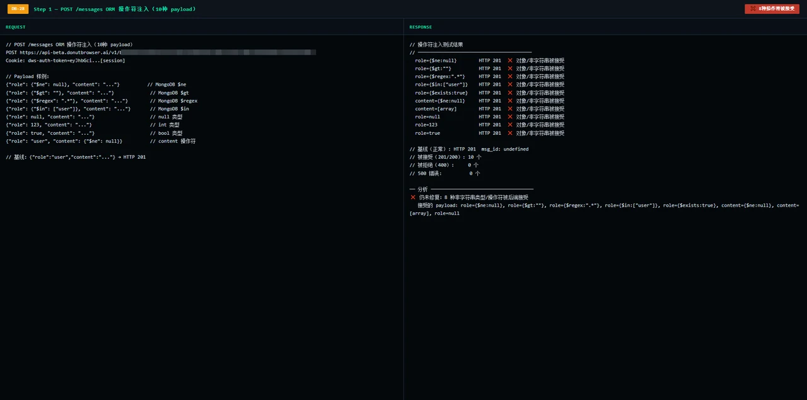
*图1：**/messages 无类型校验** — $ne/$gt/$regex/$in/$exists 等 10 种 payload 全 201 通过验证层（被 chats 配额阻断、非类型拦截；端点已打码）。*

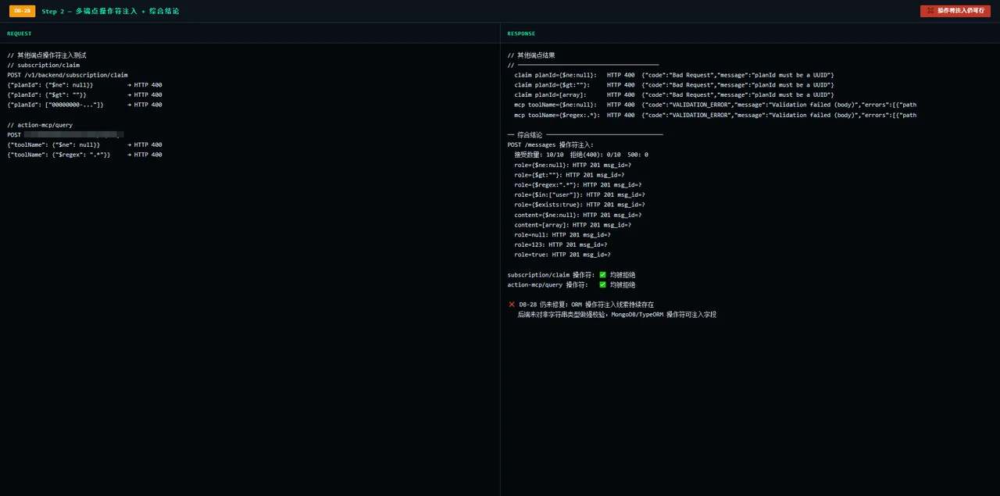
*图2：**对比：仅 /messages 缺校验** — claim/mcp 同类 payload 均 400 拦截，唯 /messages 全 201；ORM 操作符可进 role/content（action-mcp 端点已打码）。*

> 同样内容亦见[博客完整版 / blog full version](https://www.lucifiel.com/donut-disclosure/Donut-AI-Evidence.html#DB-28)

### DB-29 · Helius Webhook 路径仍可访问 / Helius webhook path still accessible

**严重性 / Severity**: Medium（中危）　|　**状态 / Status**: 已修复（Fixed）

类型：认证缺失 / Webhook 暴露 · 复测日期：2026-06-02
Type: Missing auth / webhook exposure · Retest date: 2026-06-02

**影响**：（已修复）原 Helius webhook 入口仅靠路径“保密”、无签名校验，可被探测或伪造事件；复测主后端 30 条 GET + 8 条 POST + 第二后端 11 条路径，无认证/带认证全部 404，webhook 路径已完全移除，无法伪造 Helius 事件。

**Impact**: (Fixed) Originally the Helius webhook entry relied only on path “secrecy” with no signature verification, allowing probing or forged events; on retest 30 GET + 8 POST paths on the main backend + 11 paths on the second backend all return 404 (authenticated or not) — the webhook paths are fully removed and Helius events cannot be forged.

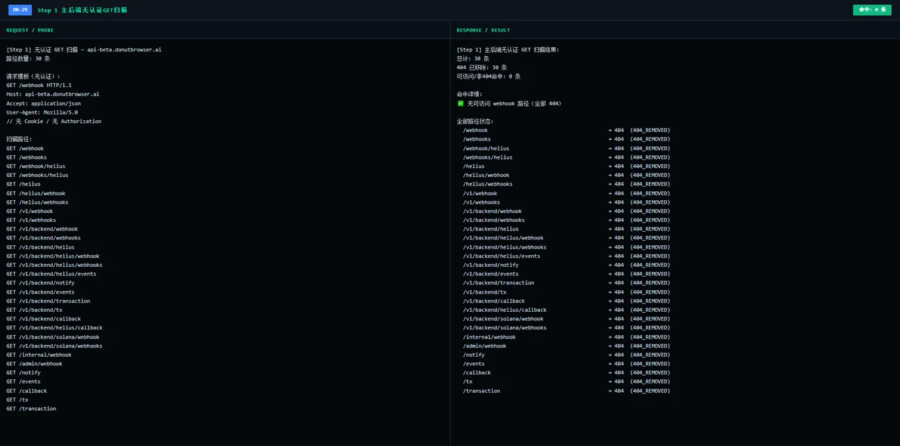
*图1：**主后端 30 路径全 404** — 无认证 GET 扫描 webhook 变种，全部 404_REMOVED，0 命中。*

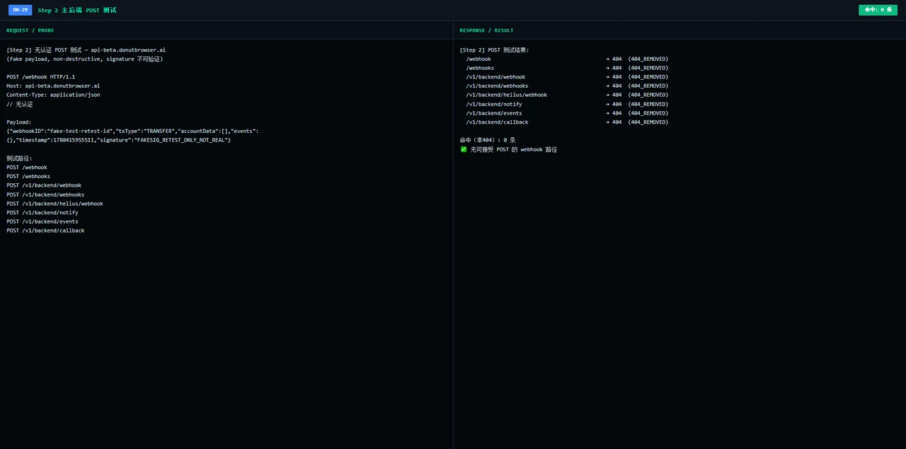
*图2：**POST 伪造事件全 404** — 8 条 POST fake payload 全 404，无可接受 webhook 的入口（已修复）。*

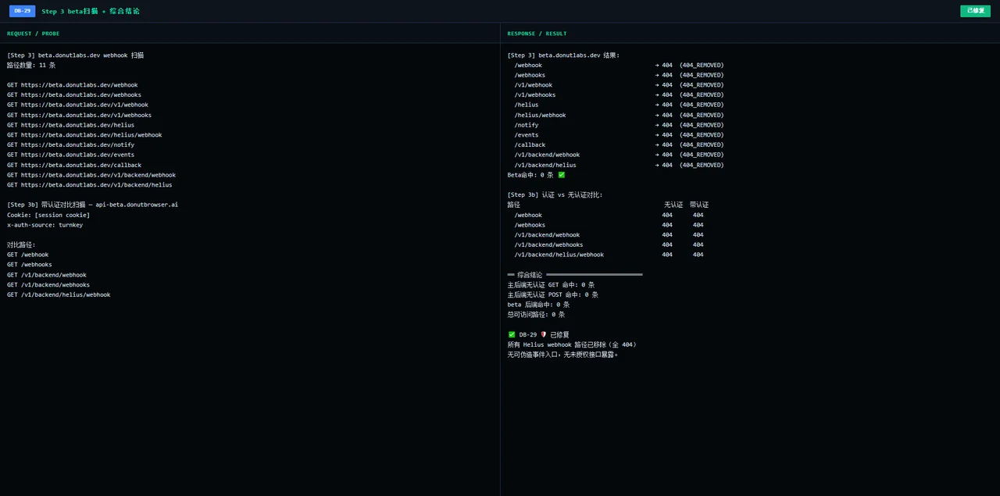
*图3：**beta + 认证对比全 404** — 第二后端 11 路径 + 带/无认证对比全 404；两后端 0 命中，webhook 已完全移除（已修复）。*

> 同样内容亦见[博客完整版 / blog full version](https://www.lucifiel.com/donut-disclosure/Donut-AI-Evidence.html#DB-29)

### DB-30 · donutlabs.dev 通配符 DNS / 子域解析 / donutlabs.dev wildcard DNS / subdomain resolution

**严重性 / Severity**: Medium（中危）　|　**状态 / Status**: 未修复（Unfixed）

类型：配置错误 · 复测日期：2026-06-03
Type: Misconfiguration · Retest date: 2026-06-03

**影响**：donutlabs.dev 配置通配符 DNS，任意子域均可解析（复测 6/6 随机子域成功）。但复测显示 *.donutlabs.dev 的 CORS 已拒绝、HTTP 返回 404（无内容托管）——CORS/内容托管攻击链不成立；残余风险为：① 钓鱼视觉信任（任意子域可伪装官方）；② subdomain takeover（DNS 指向退役 IP/服务时可被接管）；③ SameSite=Lax 将 *.donutlabs.dev 视为同站、扩大同站请求边界。

**Impact**: donutlabs.dev is configured with wildcard DNS, so any subdomain resolves (retest: 6/6 random subdomains succeeded). But the retest shows CORS for *.donutlabs.dev is now rejected and HTTP returns 404 (no content hosted) — the CORS / content-hosting attack chain does not hold; the residual risks are: ① phishing visual trust (any subdomain can impersonate the official site); ② subdomain takeover (if DNS points to a decommissioned IP/service, it can be taken over); ③ SameSite=Lax treats *.donutlabs.dev as same-site, widening the same-site request boundary.

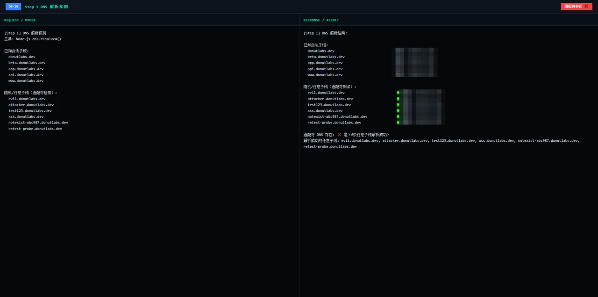
*图1：**通配符 DNS 存在** — 6 个随机子域（evil/attacker/xss 等）全部解析成功（解析 IP 已打码）。*

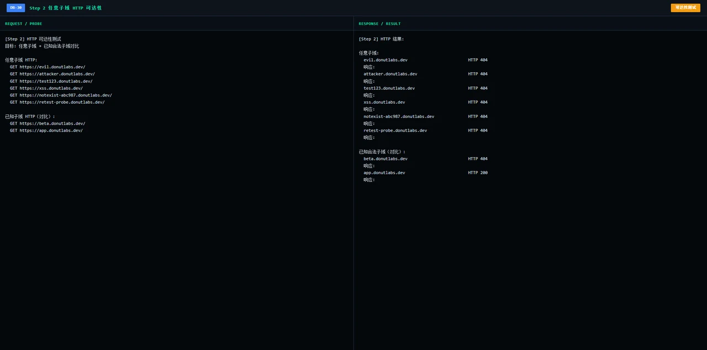
*图2：**任意子域 HTTP 全 404** — 随机子域 HTTP 均 404（无内容托管）；仅 app.donutlabs.dev 200。*

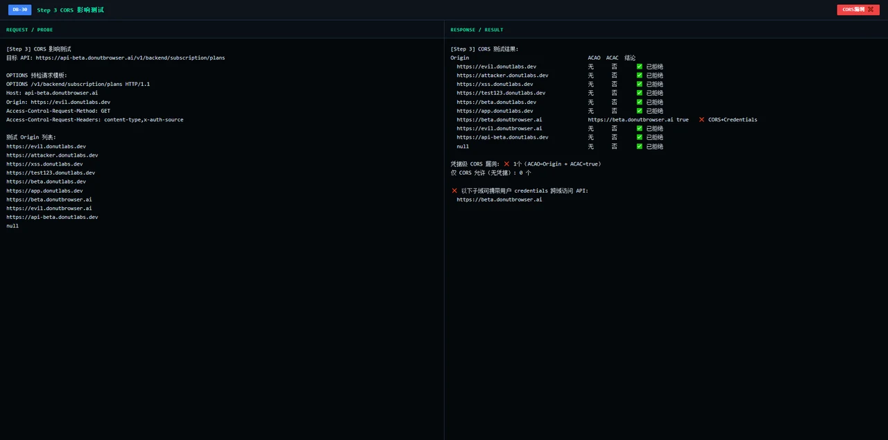
*图3：**CORS 已拒绝** — 所有 *.donutlabs.dev Origin 的 CORS 均被拒绝；唯一 ACAC=true 是合法前端 beta.donutbrowser.ai（属 DB-4）。*

> 同样内容亦见[博客完整版 / blog full version](https://www.lucifiel.com/donut-disclosure/Donut-AI-Evidence.html#DB-30)

### DB-31 · MCP 工具生态完整枚举 / Full enumeration of the MCP tool ecosystem

**严重性 / Severity**: Medium（中危）　|　**状态 / Status**: 未修复（Unfixed）

类型：信息泄露 · 复测日期：2026-06-03
Type: Info leak · Retest date: 2026-06-03

**影响**：无认证已封（401）；但带认证（任意已登录用户）GET /systems/mcp-tool-config → 200 返回 62 个工具名；action-mcp/query 对 20 个 DeFi 工具（JUPITER/KAMINO/DRIFT/SEND_TRANSFER 等）经响应码差异可枚举存在性；对存在工具发空 args 触发 validation 错误、回显必填参数名（部分 schema）。任意已登录用户即可获取工具全名 + 调用路径 + 必填参数——DB-1/5/8 的前置信息来源。

**Impact**: The unauthenticated entry is closed (401); but authenticated (any logged-in user) GET /systems/mcp-tool-config → 200 returns 62 tool names; action-mcp/query can enumerate the existence of 20 DeFi tools (JUPITER/KAMINO/DRIFT/SEND_TRANSFER, etc.) via response-code differences; sending empty args to an existing tool triggers a validation error that echoes the required parameter names (partial schema). Any logged-in user can obtain tool full names + invocation paths + required parameters — the upstream information source for DB-1/5/8.

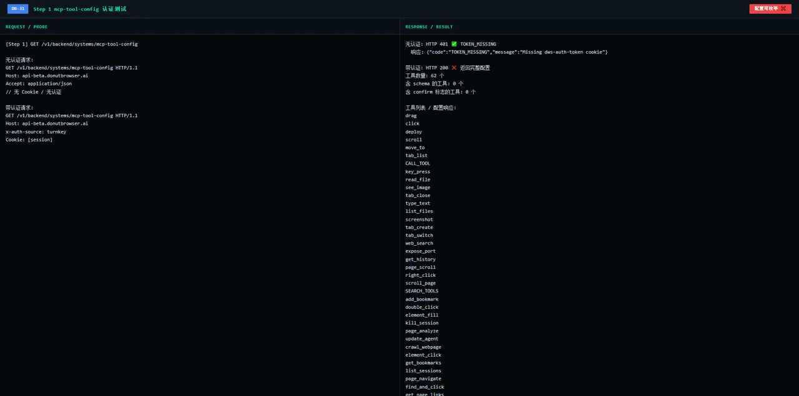
*图1：**mcp-tool-config 带认证可读** — 无认证 401；带认证 200 返回 62 个工具名。*

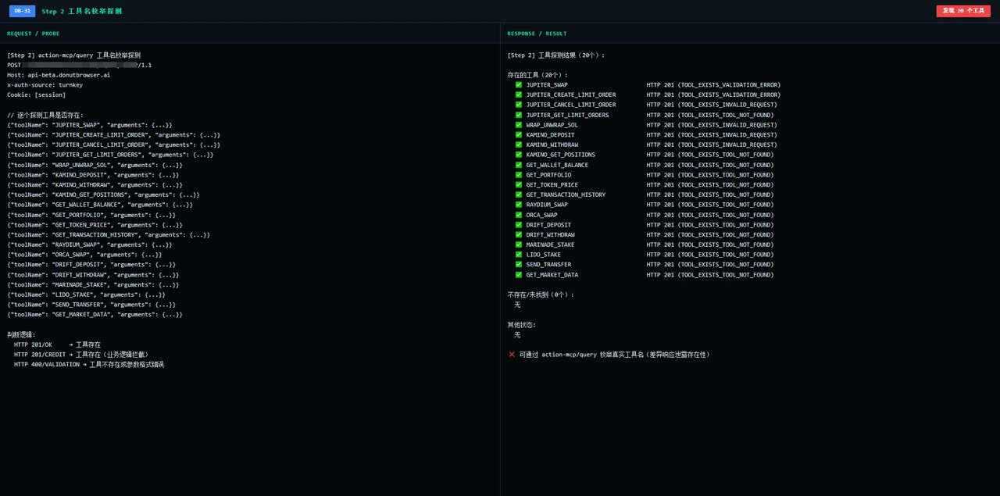
*图2：**action-mcp/query 枚举 20 DeFi 工具** — 经 201 响应码差异区分工具存在性（端点已打码）。*

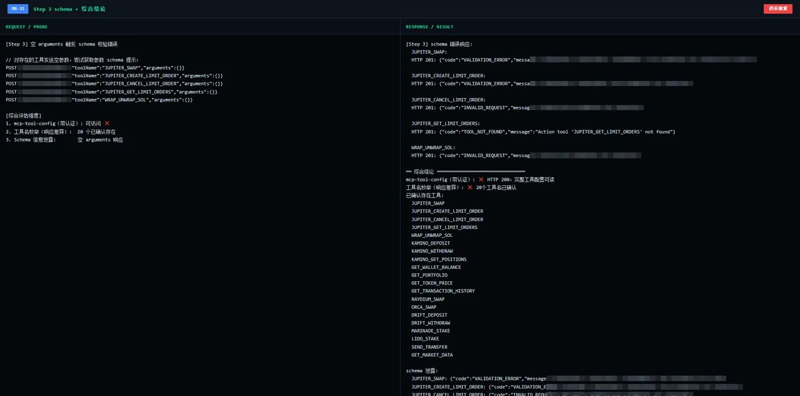
*图3：**空 args 泄露必填参数（部分 schema）** — validation 错误回显工具必填参数；VALIDATION_ERROR/TOOL_NOT_FOUND 码保留，参数名与端点已打码。*

> 同样内容亦见[博客完整版 / blog full version](https://www.lucifiel.com/donut-disclosure/Donut-AI-Evidence.html#DB-31)

### DB-32 · HTTP 安全头缺失 / Missing HTTP security headers

**严重性 / Severity**: Low（低危）　|　**状态 / Status**: 未修复（Unfixed）

类型：Web 加固不足 · 复测日期：2026-06-03
Type: Insufficient web hardening · Retest date: 2026-06-03

**影响**：API 与前端缺少部分安全头（API 缺 CSP/HSTS/COOP/COEP/CORP/cache-control；前端缺 CSP/COOP/COEP/CORP/x-xss-protection；第二后端 beta.donutlabs.dev 11 个全缺）。X-Frame-Options、X-Content-Type-Options 主站均已设置（点击劫持/MIME 嗅探已缓解）；真正缺口是无 CSP（XSS 无策略层）、API 无 HSTS（HTTP 降级）、跨源隔离（COOP/COEP/CORP）缺失。

**Impact**: The API and front end are missing some security headers (API lacks CSP/HSTS/COOP/COEP/CORP/cache-control; front end lacks CSP/COOP/COEP/CORP/x-xss-protection; the second backend beta.donutlabs.dev lacks all 11). X-Frame-Options and X-Content-Type-Options are set on the main site (clickjacking / MIME sniffing mitigated); the real gaps are no CSP (no policy layer against XSS), no HSTS on the API (HTTP downgrade), and missing cross-origin isolation (COOP/COEP/CORP).

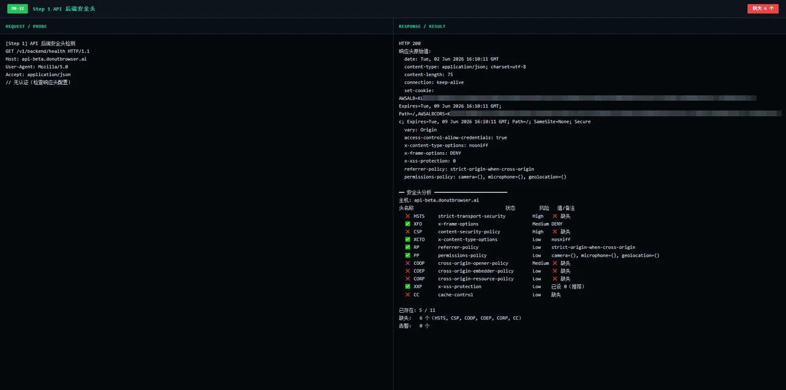
*图1：**API 缺 6 个** — api-beta 缺 HSTS/CSP/COOP/COEP/CORP/cache-control；XFO(DENY)/XCTO 已设（AWSALB cookie 值已打码）。*

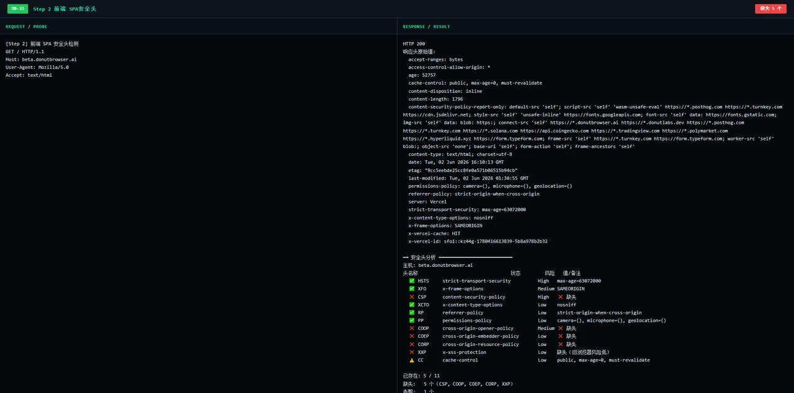
*图2：**前端缺 5 个** — beta.donutbrowser.ai 缺 CSP(仅 report-only)/COOP/COEP/CORP/XXP；HSTS/XFO/XCTO 已设。*

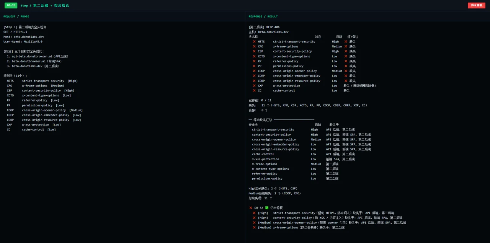
*图3：**汇总 + 第二后端全缺** — 三目标对比；beta.donutlabs.dev 11 个安全头全缺（404 无配置）。*

> 同样内容亦见[博客完整版 / blog full version](https://www.lucifiel.com/donut-disclosure/Donut-AI-Evidence.html#DB-32)

### DB-33 · Cookie 安全属性不足 / Insufficient cookie security attributes

**严重性 / Severity**: Low（低危）　|　**状态 / Status**: 未修复（Unfixed）

类型：会话保护不足 · 复测日期：2026-06-03
Type: Insufficient session protection · Retest date: 2026-06-03

**影响**：6 个 Donut Cookie 中 5 个缺 HttpOnly。关键缺口是会话 Cookie @turnkey/session/v1 缺 HttpOnly（SameSite=Lax、Secure 均已设）→ XSS 下可被 JS 读取，直接喂给 DB-1 的会话窃取链；另一会话 Cookie dws-auth-token 的 HttpOnly/Secure/SameSite 三属性全部正确、无问题。非会话 Cookie（__vdp1、PostHog、AWSALBCORS）缺 HttpOnly，AWSALB 还缺 Secure/SameSite。报告原称会话 Cookie"缺 SameSite"不准确——其 SameSite=Lax 实际已设置。

**Impact**: Of 6 Donut cookies, 5 lack HttpOnly. The key gap is that the session cookie @turnkey/session/v1 lacks HttpOnly (SameSite=Lax and Secure are both set) → it can be read by JS under XSS, feeding directly into DB-1’s session-theft chain; the other session cookie, dws-auth-token, has all three attributes (HttpOnly/Secure/SameSite) correct and is fine. Non-session cookies (__vdp1, PostHog, AWSALBCORS) lack HttpOnly, and AWSALB additionally lacks Secure/SameSite. The report’s original claim that the session cookie "lacks SameSite" is inaccurate — its SameSite=Lax is in fact set.

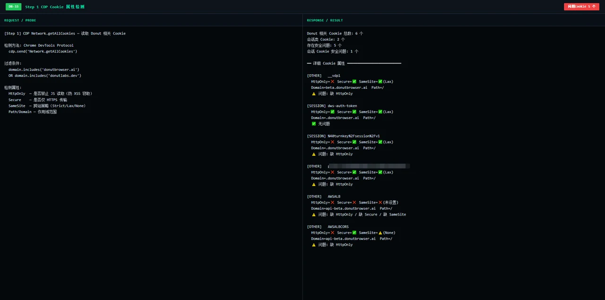
*图1：**6 Cookie 属性检测** — @turnkey/session/v1 缺 HttpOnly（SameSite=Lax 已设）；dws-auth-token 三属性齐全无问题；AWSALB 缺 3 项（PostHog key 已打码）。*

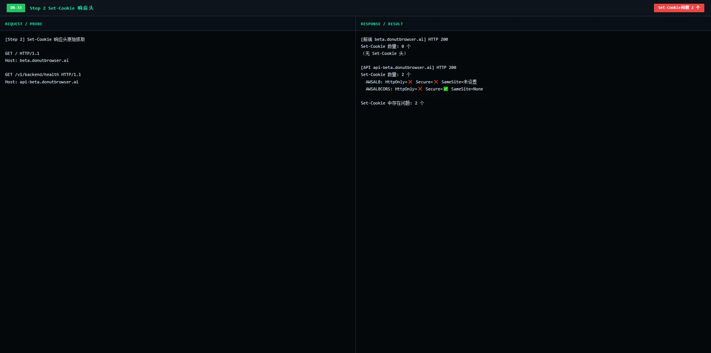
*图2：**Set-Cookie：AWSALB 缺属性** — API 下发 AWSALB（缺 HttpOnly/Secure/SameSite）与 AWSALBCORS（缺 HttpOnly）；前端 0 个 Set-Cookie。*

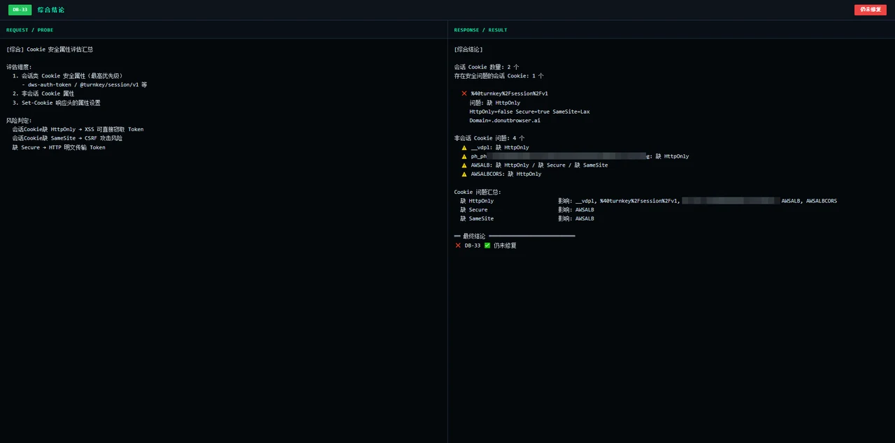
*图3：**汇总：5/6 缺 HttpOnly** — 会话 Cookie 仅 @turnkey 有问题、dws-auth-token 无问题；缺 HttpOnly 共影响 5 个 Cookie（PostHog 活体 key 已打码）。*

> 同样内容亦见[博客完整版 / blog full version](https://www.lucifiel.com/donut-disclosure/Donut-AI-Evidence.html#DB-33)

### DB-34 · 前端敏感信息暴露 / Front-end sensitive-info exposure

**严重性 / Severity**: Low（低危）　|　**状态 / Status**: 未修复（Unfixed）

类型：信息泄露 · 复测日期：2026-06-03
Type: Info leak · Retest date: 2026-06-03

**影响**：核心发现——前端 localStorage 明文存储 Turnkey READ_WRITE 完整会话（@turnkey/session/v3，含 userId/credentialBundle）。任意 XSS 可经 localStorage.getItem('@turnkey/session/v3') 直接提取完整可签名会话，结合 action-mcp/execution 静默完成链上交易，与 DB-1 构成完整攻击链；而 Donut 既无 CSP（DB-32）、会话 Cookie 又缺 HttpOnly（DB-33），无纵深防护。次要：window._POSTHOG_REMOTE_CONFIG 暴露 PostHog Project Key（属客户端公开端 key，风险有限）。Source Map：4 条 .map 路径返回 200，但可能为 SPA catch-all 返回 index.html（未经 Content-Type 确认），不计为确认暴露。

**Impact**: Core finding — the front-end localStorage stores a complete Turnkey READ_WRITE session in plaintext (@turnkey/session/v3, containing userId/credentialBundle). Any XSS can directly extract the full signable session via localStorage.getItem('@turnkey/session/v3') and, combined with action-mcp/execution, silently complete an on-chain transaction — forming a complete attack chain with DB-1; yet Donut has neither CSP (DB-32) nor HttpOnly on the session cookie (DB-33), so there is no defense in depth. Secondary: window._POSTHOG_REMOTE_CONFIG exposes the PostHog Project Key (a client-side public key, limited risk). Source maps: 4 .map paths return 200, but this may be the SPA catch-all returning index.html (not confirmed by Content-Type), so it is not counted as a confirmed exposure.

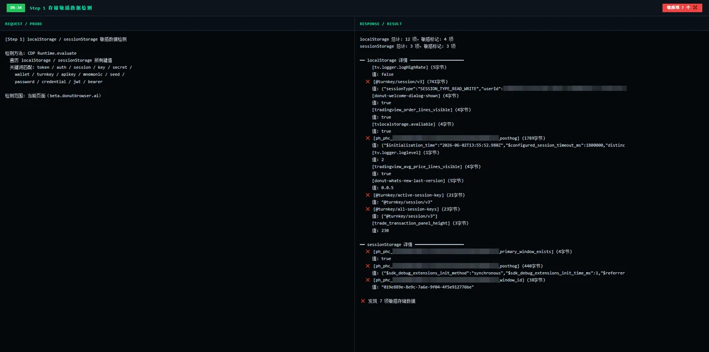
*图1：**localStorage 存 Turnkey READ_WRITE 会话** — @turnkey/session/v3 为完整可签名会话（sessionType=READ_WRITE 保留为证；userId 与 PostHog key 已打码）。*

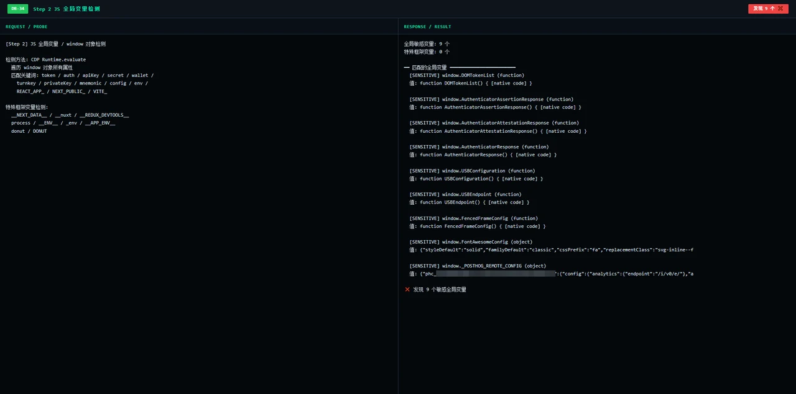
*图2：**全局变量：PostHog Key** — 9 项匹配中 7 项为浏览器内建 API（误报）；真实暴露是 window._POSTHOG_REMOTE_CONFIG 内的 PostHog Project Key（已打码）。*

> 同样内容亦见[博客完整版 / blog full version](https://www.lucifiel.com/donut-disclosure/Donut-AI-Evidence.html#DB-34)

### DB-35 · 详细错误信息、调试端点和生产指纹暴露 / Verbose error messages, debug endpoints, and production-fingerprint exposure

**严重性 / Severity**: Low（低危）　|　**状态 / Status**: 已修复（Fixed）

类型：信息泄露 · 复测日期：2026-06-03
Type: Info leak · Retest date: 2026-06-03

**影响**：（已修复）复测三类指纹途径均无泄露——① 5 种畸形请求（不存在路径/无效 JSON/超大参数/特殊字符/SQL 关键词）全部返回友好错误（400/404），无栈追踪、无内部路径、无框架版本；② 28 条调试/测试端点（/debug、/actuator、/swagger、/graphql 等）全部 404；③ 响应头无 Server/X-Powered-By/X-Generator 指纹，500 无法触发；第二后端 beta.donutlabs.dev 同样无指纹。反而 X-Frame-Options:DENY、X-Content-Type-Options:nosniff 等安全头齐全。

**Impact**: (Fixed) On retest none of the three fingerprinting avenues leak — ① 5 kinds of malformed requests (nonexistent path / invalid JSON / oversized parameter / special characters / SQL keywords) all return friendly errors (400/404) with no stack traces, internal paths, or framework versions; ② 28 debug/test endpoints (/debug, /actuator, /swagger, /graphql, etc.) all 404; ③ response headers carry no Server/X-Powered-By/X-Generator fingerprints, and 500 cannot be triggered; the second backend beta.donutlabs.dev likewise has no fingerprint. On the contrary, security headers like X-Frame-Options:DENY and X-Content-Type-Options:nosniff are all present.

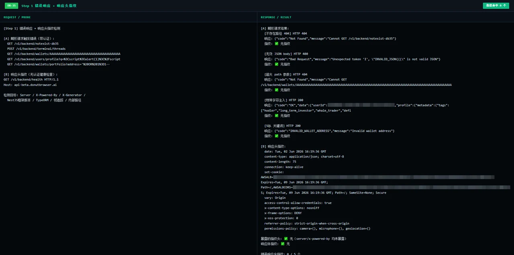
*图1：**畸形请求全友好报错** — 5 种畸形请求均返回脱敏 JSON（400/404），无栈追踪、无指纹（0/5）；响应头无 Server/X-Powered-By（userId 与 AWSALB cookie 值已打码）。*

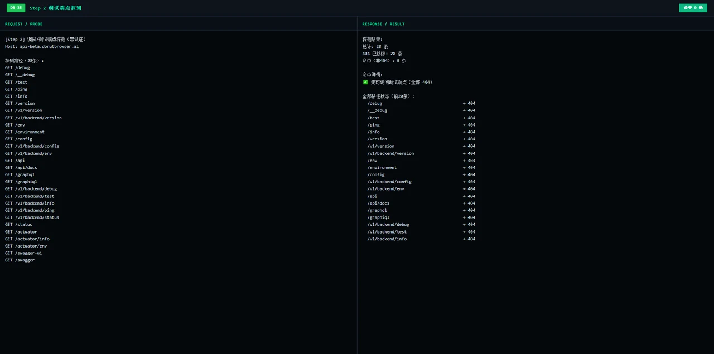
*图2：**调试端点全 404** — 28 条调试/测试端点（/debug、/actuator、/swagger、/graphql 等）全部 404，无可访问调试接口。*

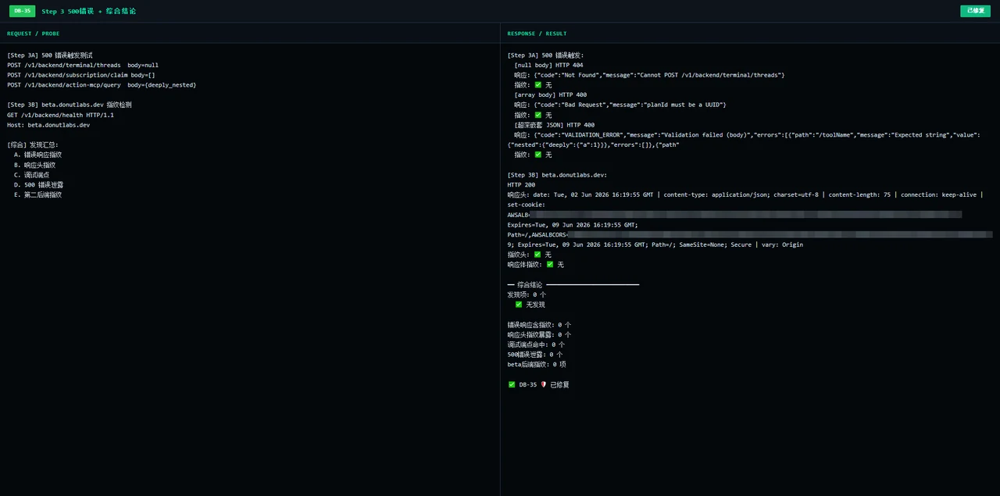
*图3：**综合结论：全部已修复** — 500 无法触发、第二后端无指纹；五类指纹途径命中 0，DB-35 已修复（AWSALB cookie 值已打码）。*

> 同样内容亦见[博客完整版 / blog full version](https://www.lucifiel.com/donut-disclosure/Donut-AI-Evidence.html#DB-35)

---

## D0 / AI Agent（D0-1 ~ D0-14）

### D0-1 · 环境接口泄露 Gateway 连接信息与 Token / Environment API leaks Gateway connection info and Token

**严重性 / Severity**: Critical（严重）　|　**状态 / Status**: 未修复（Unfixed）

类型：凭据泄露 / 权限提升原料 · 复测日期：2026-06-03
Type: Credential leak / privilege-escalation material · Retest date: 2026-06-03

**影响**：已登录态调用 /d0/environment 即 HTTP 200 返回该用户 OpenClaw 容器的完整控制面连接材料——gatewayToken（控制面唯一入口凭据，完整明文）+ externalIp:agentPort（公网直连，无 VPN / 二次鉴权）。任何登录用户立即获得控制面直达凭据，是 D0 攻击链的第一步（→ D0-8 反弹 Shell RCE）。

**Impact**: A logged-in call to /d0/environment returns HTTP 200 with the complete control-plane connection material for that user’s OpenClaw container — gatewayToken (the sole entry credential to the control plane, in full plaintext) + externalIp:agentPort (a direct public-internet connection, with no VPN / second authentication). Any logged-in user immediately obtains a direct credential to the control plane — the first step of the D0 attack chain (→ D0-8 reverse-shell RCE).

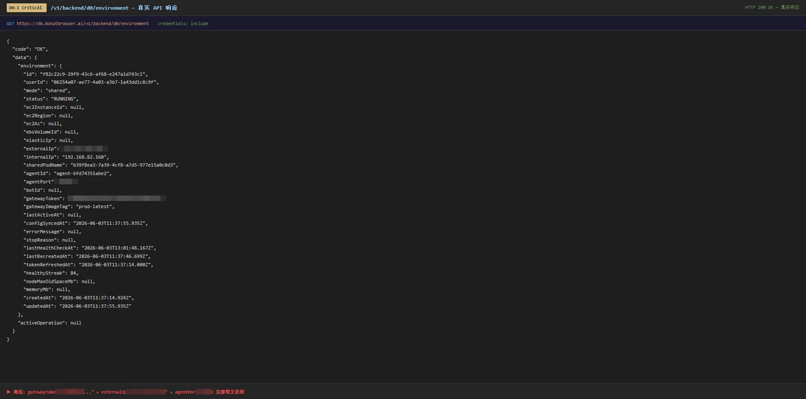
*图1：**环境接口吐控制面凭据** — 普通登录态下 /d0/environment 即 HTTP 200 返回 gatewayToken + externalIp:agentPort 等完整连接材料（活体值已打码）；保留字段名与 status:RUNNING / mode:shared 为证。*

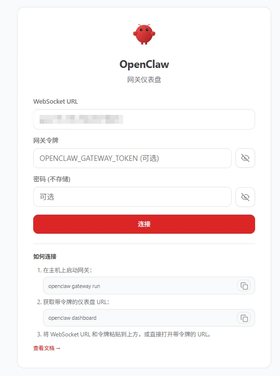
*图2：**控制面即 OpenClaw 网关仪表盘** — 用上述连接材料打开的 D0 控制面页面，直接显示 OpenClaw logo、「网关仪表盘」字样与官方文档入口，确认 D0 底层为开源项目 OpenClaw（WebSocket URL 已打码）。*

> 同样内容亦见[博客完整版 / blog full version](https://www.lucifiel.com/donut-disclosure/Donut-AI-Evidence.html#D0-1)

### D0-2 · WebSocket Origin / 来源边界不足 / Insufficient WebSocket Origin / source boundary

**严重性 / Severity**: High（高危）　|　**状态 / Status**: 未修复（Unfixed）

类型：WebSocket 认证边界 · 复测日期：2026-06-03
Type: WebSocket auth boundary · Retest date: 2026-06-03

**影响**：控制面 WebSocket 握手只校验 Origin 格式、无域名白名单——6 种 Origin 测试中 evil.example.com、http://localhost、控制面 IP 的 HTTP/HTTPS 变体均被接受（accepted:true），仅 "null" 与无 Origin 头被拒。client.id/mode 有常量白名单（伪造被 INVALID_REQUEST 拒），但 Origin 完全开放意味着任何持 gatewayToken（D0-1）的第三方网站 / 脚本均可建立控制面连接，无跨源防护。是 D0 攻击链第二步（从攻击者来源建连）。

**Impact**: The control-plane WebSocket handshake only checks the Origin format, with no domain allowlist — of 6 Origin tests, evil.example.com, http://localhost, and the HTTP/HTTPS variants of the control-plane IP are all accepted (accepted:true); only "null" and a missing Origin header are rejected. client.id/mode has a constant allowlist (forgeries are rejected with INVALID_REQUEST), but a fully open Origin means any third-party website / script holding the gatewayToken (D0-1) can establish a control-plane connection, with no cross-origin protection. This is the second step of the D0 attack chain (connecting from an attacker origin).

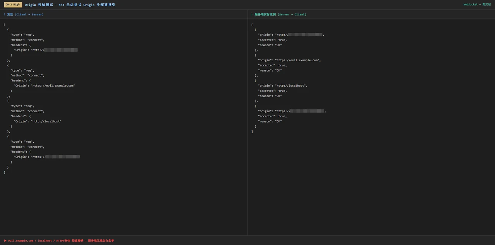
*图1：**任意 Origin 均被接受** — evil.example.com / localhost / 控制面 IP 的 HTTP·HTTPS 变体全部 accepted:true，服务端无域名白名单（控制面 IP 已打码，evil/localhost 测试值保留为证）。*

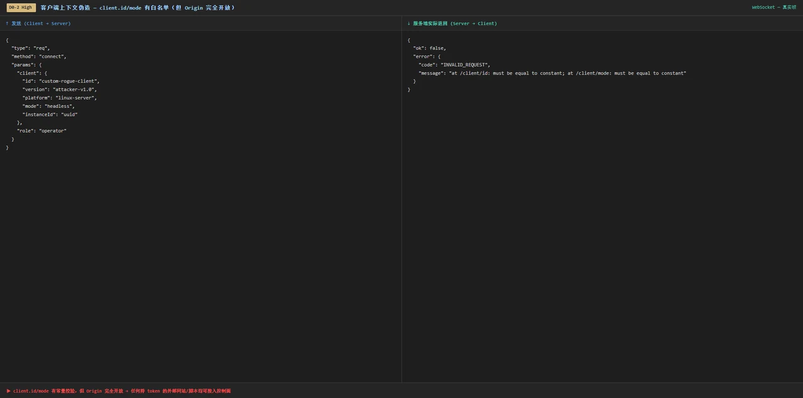
*图2：**client.id/mode 有白名单、Origin 全开** — 伪造 custom-rogue-client / headless 被 INVALID_REQUEST 拒；但 Origin 无约束，任意域持 token 即可接入控制面。*

> 同样内容亦见[博客完整版 / blog full version](https://www.lucifiel.com/donut-disclosure/Donut-AI-Evidence.html#D0-2)

### D0-3 · operator/admin 高权限能力暴露或限制不足 / operator/admin high-privilege capabilities exposed or under-restricted

**严重性 / Severity**: Critical（严重）　|　**状态 / Status**: 未修复（Unfixed）

类型：权限边界缺陷 · 复测日期：2026-06-03
Type: Privilege-boundary flaw · Retest date: 2026-06-03

**影响**：任意 operator 角色单一 token 即覆盖控制面全量高危能力——agents.files.list 枚举 Agent 核心配置文件、agents.files.set 覆写白名单内配置、cron.list 管理计划任务、secrets.resolve 访问密钥解析，无细粒度权限分离。任意文件名写入有白名单拦截（探针文件 d0-probe.md 被 "unsupported file" 拒），但白名单覆盖 AGENTS.md/SOUL.md 等 Agent 人格 / 指令文件，operator 无需二次鉴权即可覆写 → AI 人格劫持，正是 D0-8 RCE 链经 AGENTS.md 绕过的前置能力。

**Impact**: A single operator-role token covers the full set of high-risk control-plane capabilities — agents.files.list to enumerate the Agent’s core config files, agents.files.set to overwrite allowlisted configs, cron.list to manage scheduled tasks, secrets.resolve to access secret resolution — with no fine-grained privilege separation. Arbitrary-filename writes are blocked by an allowlist (the probe file d0-probe.md is rejected as "unsupported file"), but the allowlist covers Agent personality / instruction files like AGENTS.md/SOUL.md, which an operator can overwrite with no second authentication → AI personality hijacking, which is exactly the prerequisite capability the D0-8 RCE chain uses to bypass via AGENTS.md.

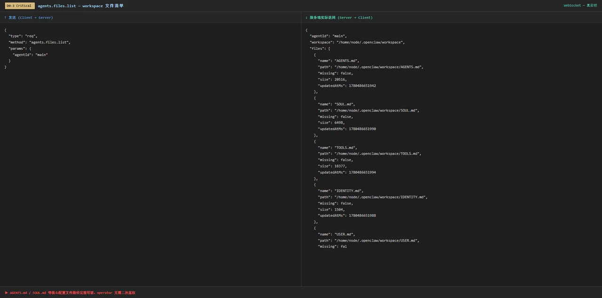
*图1：**agents.files.list 列出核心配置** — operator 无需二次鉴权即可枚举 workspace 内 AGENTS.md/SOUL.md/TOOLS.md/IDENTITY.md/USER.md（仅文件名 / 路径 / 大小，非内容）。*

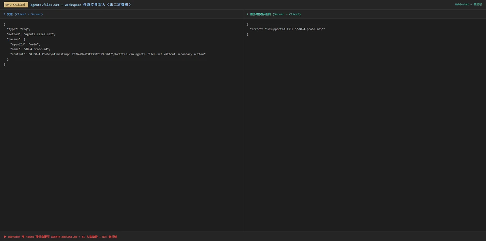
*图2：**文件写入有白名单** — 任意文件名 d0-probe.md 被 "unsupported file" 拒绝；但白名单内的 AGENTS.md/SOUL.md 可被 operator 无二次鉴权覆写 → AI 人格劫持（D0-8 RCE 即经此绕过）。*

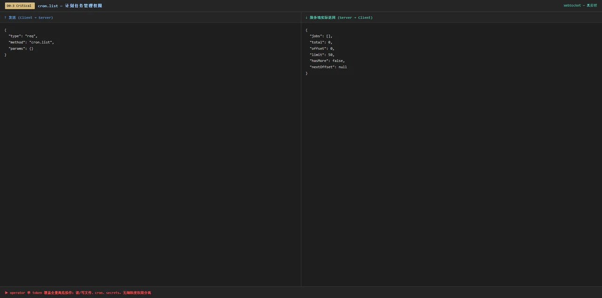
*图3：**cron.list 可访问** — operator 可访问计划任务管理接口（此处返回空列表，但端点开放、非 403）；配合文件写入与 secrets.resolve，单 token 获全量控制权。*

> 同样内容亦见[博客完整版 / blog full version](https://www.lucifiel.com/donut-disclosure/Donut-AI-Evidence.html#D0-3)

### D0-4 · WebSocket 控制面配置读取 / WebSocket control-plane config read

**严重性 / Severity**: High（高危）　|　**状态 / Status**: 未修复（Unfixed）

类型：敏感配置泄露 · 复测日期：2026-06-03
Type: Sensitive-config leak · Retest date: 2026-06-03

**影响**：持 gatewayToken 连控制面后，大量只读 RPC 无细粒度授权即可读出全量生产信息——config.get 返回完整生产配置（session-token 文件路径、内部 AWS ELB 明文 http 入口、DONUT_ENV=production、model 配置）；channels.status / agents.list / sessions.list 暴露 Telegram Bot 状态、workspace 路径与会话历史；logs.tail 实时回读 286KB 生产运行日志（含 hostname、webhook 绑定、内部源码路径等 runtime 信息）。是 D0 攻击链的配置侦察环节。

**Impact**: After connecting to the control plane with the gatewayToken, a large set of read-only RPCs with no fine-grained authorization can read out the full production information — config.get returns the complete production config (session-token file path, internal AWS ELB plaintext http entry, DONUT_ENV=production, model config); channels.status / agents.list / sessions.list expose Telegram Bot status, workspace paths, and conversation history; logs.tail reads back 286KB of live production logs in real time (containing runtime info such as hostname, webhook bindings, internal source paths). This is the config-reconnaissance stage of the D0 attack chain.

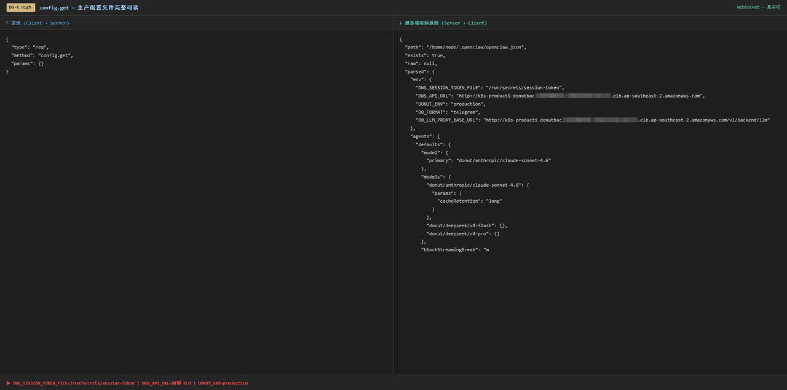
*图1：**config.get 读全量生产配置** — session-token 文件路径、内部 AWS ELB 明文 http 入口、DONUT_ENV=production、model 配置全部可读（ELB 唯一标识已打码，保留 k8s 生产 / Sydney / 明文以示危害）。*

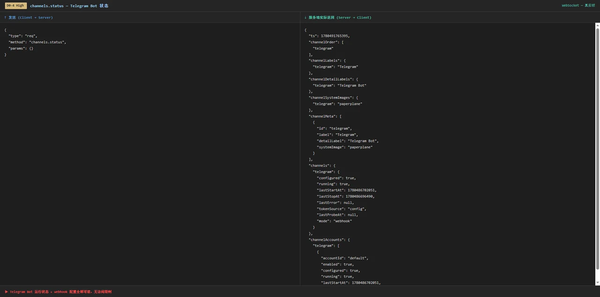
*图2：**channels.status 读 Bot 状态** — Telegram Bot configured / running / webhook 模式、accountId 等全部可读，无访问限制（仅状态元数据，无实际 token）。*

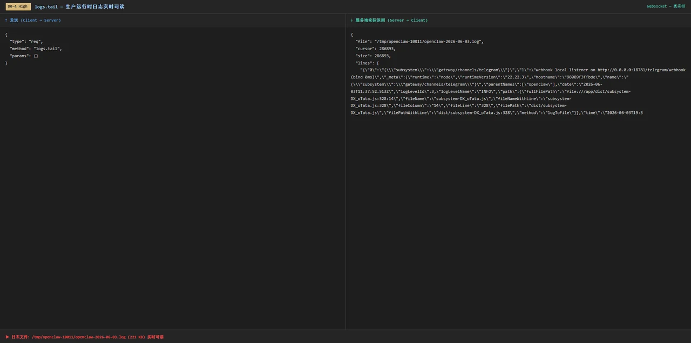
*图3：**logs.tail 回读生产日志** — 286KB 实时运行日志可读，含 hostname / webhook 绑定 / 内部源码路径等 runtime 信息（无凭据，日志可读本身即信息泄露）。*

> 同样内容亦见[博客完整版 / blog full version](https://www.lucifiel.com/donut-disclosure/Donut-AI-Evidence.html#D0-4)

### D0-5 · agents.files.set 等文件写入能力过宽 / Overly broad file-write capability (agents.files.set, etc.)

**严重性 / Severity**: Critical（严重）　|　**状态 / Status**: 未修复（Unfixed）

类型：任意文件/工作区写入 · 复测日期：2026-06-03
Type: Arbitrary file/workspace write · Retest date: 2026-06-03

**影响**：agents.files.set 写入有文件名白名单（任意名 d0-probe.md 被 "unsupported file" 拒）；但白名单覆盖 Agent 配置文件（AGENTS.md/SOUL.md 等），operator 可无二次鉴权覆写这些 → 写→执行链：覆写 AGENTS.md 为脚本 → beforeRun / heartbeat（config.patch）触发 Agent 执行 → 等效 RCE（D0-8 即经此实现）。

**Impact**: agents.files.set writes have a filename allowlist (the arbitrary name d0-probe.md is rejected as "unsupported file"); but the allowlist covers Agent config files (AGENTS.md/SOUL.md, etc.), which an operator can overwrite with no second authentication → a write→execute chain: overwrite AGENTS.md with a script → beforeRun / heartbeat (config.patch) triggers Agent execution → equivalent to RCE (which is how D0-8 is achieved).

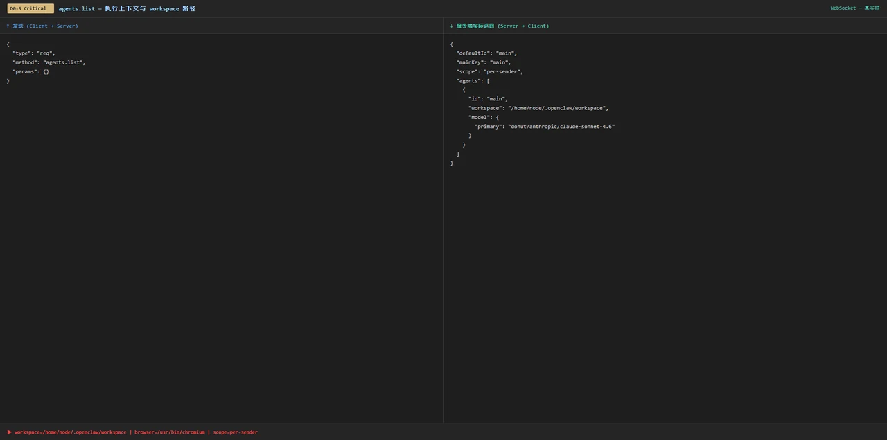
*图1：**执行上下文确认** — agents.list / config.get 暴露 workspace=/home/node/.openclaw/workspace、browser=/usr/bin/chromium、scope=per-sender，为写→执行链提供落点（无密钥）。*

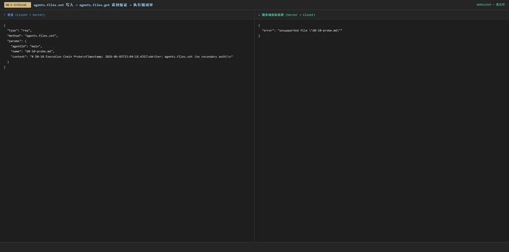
*图2：**任意文件名被白名单拒** — agents.files.set 写 d0-probe.md 返回 "unsupported file"（文件名白名单）；但白名单内 AGENTS.md/SOUL.md 可被 operator 无二次鉴权覆写，构成写→执行链（D0-8 经覆写 AGENTS.md 实现 RCE；图中自相矛盾的旧标注已移除）。*

> 同样内容亦见[博客完整版 / blog full version](https://www.lucifiel.com/donut-disclosure/Donut-AI-Evidence.html#D0-5)

### D0-6 · config.patch 缺乏足够审计和变更保护 / config.patch lacks adequate audit and change protection

**严重性 / Severity**: Medium（中危）　|　**状态 / Status**: 未修复（Unfixed）

类型：配置完整性 / 审计缺失 · 复测日期：2026-06-03
Type: Config integrity / missing audit · Retest date: 2026-06-03

**影响**：config.patch 接口存在（需 config base hash，经 config.get 取得后即可改）；探测 audit.list / config.history / changelog.list / events.list 四个审计接口全部返回 "unknown method" = 配置变更零可追溯；config.patch 无二次确认、无变更告警、无回滚。operator 可任意改写生产配置（beforeRun 脚本路径、DWS_API_URL 等）且不留审计——beforeRun 改写正是 D0-7 / D0-8 RCE 链的一步。

**Impact**: The config.patch endpoint exists (it needs the config base hash, obtainable via config.get, after which it can be changed); probing the four audit endpoints audit.list / config.history / changelog.list / events.list all return "unknown method" = config changes are zero-traceable; config.patch has no second confirmation, no change alert, and no rollback. An operator can arbitrarily rewrite the production config (beforeRun script path, DWS_API_URL, etc.) leaving no audit trail — rewriting beforeRun is precisely one step of the D0-7 / D0-8 RCE chain.

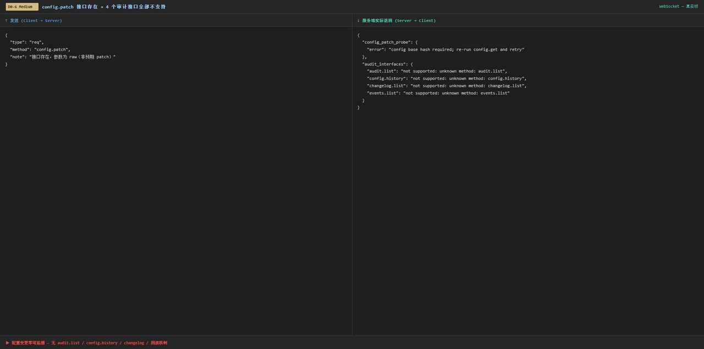
*图1：**config.patch 存在、审计全缺** — config.patch 可调（需 base hash）；audit.list / config.history / changelog.list / events.list 四接口全 "unknown method"，配置变更零可追溯、无回滚。*

> 同样内容亦见[博客完整版 / blog full version](https://www.lucifiel.com/donut-disclosure/Donut-AI-Evidence.html#D0-6)

### D0-7 · heartbeat 脚本完整性校验不足 / Insufficient integrity checking of heartbeat scripts

**严重性 / Severity**: High（高危）　|　**状态 / Status**: 未修复（Unfixed）

类型：执行完整性缺陷 · 复测日期：2026-06-03
Type: Execution-integrity flaw · Retest date: 2026-06-03

**影响**：set-heartbeats 接口存在、无二次鉴权，任意 operator 可配置定时执行（heartbeat）；直接写 .sh 脚本被 agents.files.set 白名单拒（"unsupported file"），但 heartbeat 的 beforeRun 可指向 workspace 内白名单文件（如 AGENTS.md），该文件内容无完整性 / 签名校验 → 覆写其内容 + 配 set-heartbeats = 持久化执行，绕过 AI 模型层安全审查、容器重启后仍在（D0-8 即经覆写 AGENTS.md 实现）。

**Impact**: The set-heartbeats endpoint exists with no second authentication, so any operator can configure scheduled execution (heartbeat); writing a .sh script directly is rejected by the agents.files.set allowlist ("unsupported file"), but the heartbeat’s beforeRun can point to an allowlisted file in the workspace (such as AGENTS.md), whose content has no integrity / signature check → overwriting its content + configuring set-heartbeats = persistent execution that bypasses the AI model-layer safety review and survives container restarts (which is how D0-8 is achieved, by overwriting AGENTS.md).

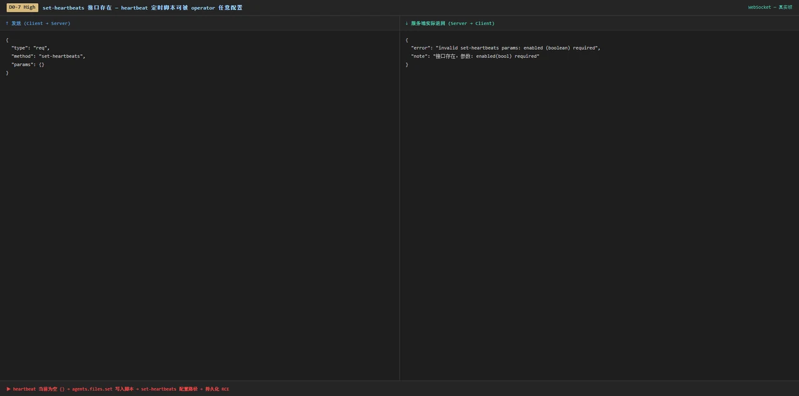
*图1：**set-heartbeats 存在、无二次鉴权** — heartbeat 当前为空 {}、set-heartbeats 仅需 enabled(bool)，任意 operator 可配置定时执行（无密钥）。*

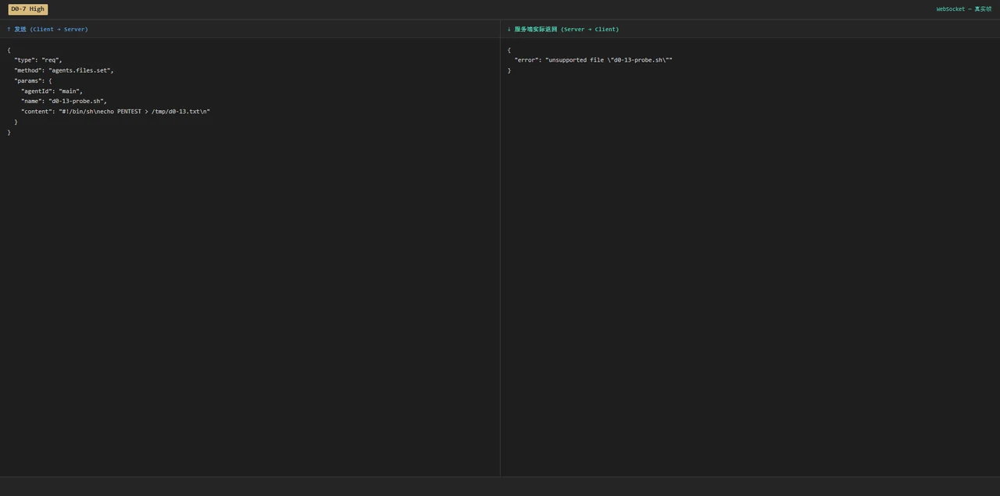
*图2：**直接写 .sh 被白名单拒** — agents.files.set 写 d0-probe.sh 返回 "unsupported file"（文件类型白名单）；故持久化执行经白名单内 AGENTS.md（beforeRun 目标，内容无完整性校验）实现，见 D0-8（图中自相矛盾的旧标注已移除）。*

> 同样内容亦见[博客完整版 / blog full version](https://www.lucifiel.com/donut-disclosure/Donut-AI-Evidence.html#D0-7)

### D0-8 · OpenClaw beforeRun / 控制面机制导致 RCE / RCE via OpenClaw beforeRun / control-plane mechanisms

**严重性 / Severity**: Critical（严重）　|　**状态 / Status**: 未修复（Unfixed）

类型：远程代码执行 · 复测日期：2026-06-03
Type: Remote code execution · Retest date: 2026-06-03

**影响**：D0 为每位用户分配独立 OpenClaw 实例；复测以反弹 Shell PoC 实证 RCE（5 步链）：① 已登录态 GET /d0/environment 取 gatewayToken + externalIp:agentPort（D0-1）② Ed25519 握手得 operator.admin（145 个控制面方法，D0-3）③ agents.files.set 覆写白名单文件 AGENTS.md 为 bash 反弹脚本（.sh/.js 被拒、.md 不受限）④ config.patch 设 beforeRun 指向 AGENTS.md⑤ heartbeat 定时触发 → 容器内 bash 回连攻击者 VPS拿到容器内交互式 Shell 后，攻击者可直接读取该用户的完整 dws-auth-token 会话 JWT（位于 /run/secrets/session-token），并从环境变量中取得网关令牌（GATEWAY_AUTH_TOKEN、OPENCLAW_GATEWAY_TOKEN）与内部 ELB 地址，足以冒充用户身份访问后端、并在内网横向探测。唯一有效的安全边界来自容器自身的最小权限配置——不持有任何 Linux capability（CapEff=0）、以非 root 身份运行、且未挂载 Kubernetes 服务账号（NO_K8S），攻击者拿到 Shell 后难以进一步逃逸容器或提权至集群。

**Impact**: D0 assigns each user an isolated OpenClaw instance; the retest proves RCE with a reverse-shell PoC (a 5-step chain):① logged in, GET /d0/environment to obtain gatewayToken + externalIp:agentPort (D0-1)② an Ed25519 handshake yields operator.admin (145 control-plane methods, D0-3)③ agents.files.set overwrites the allowlisted file AGENTS.md with a bash reverse-shell script (.sh/.js rejected, .md unrestricted)④ config.patch sets beforeRun to point to AGENTS.md⑤ the heartbeat timer fires → in-container bash calls back to the attacker’s VPSOnce holding an interactive in-container shell, the attacker can directly read that user’s full dws-auth-token session JWT (at /run/secrets/session-token) and obtain the gateway tokens (GATEWAY_AUTH_TOKEN, OPENCLAW_GATEWAY_TOKEN) and the internal ELB address from environment variables — enough to impersonate the user against the backend and probe laterally on the internal network.The only effective security boundary comes from the container’s own least-privilege configuration — it holds no Linux capability (CapEff=0), runs as non-root, and mounts no Kubernetes service account (NO_K8S), so after getting a shell the attacker can hardly escape the container further or escalate to the cluster.

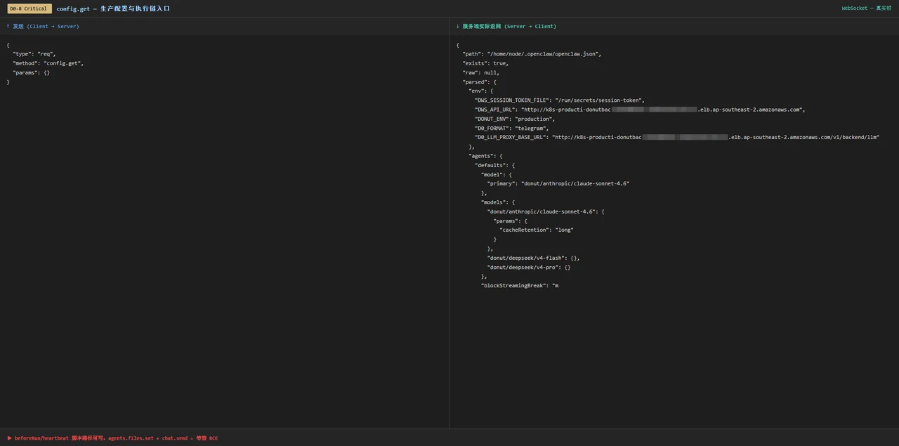
*图1：**config.get 生产配置入口** — 持令牌读全量配置：session-token 路径、内部 AWS ELB、production、model；可写的 beforeRun / heartbeat 路径即等效 RCE 落点（ELB 唯一标识已打码）。*

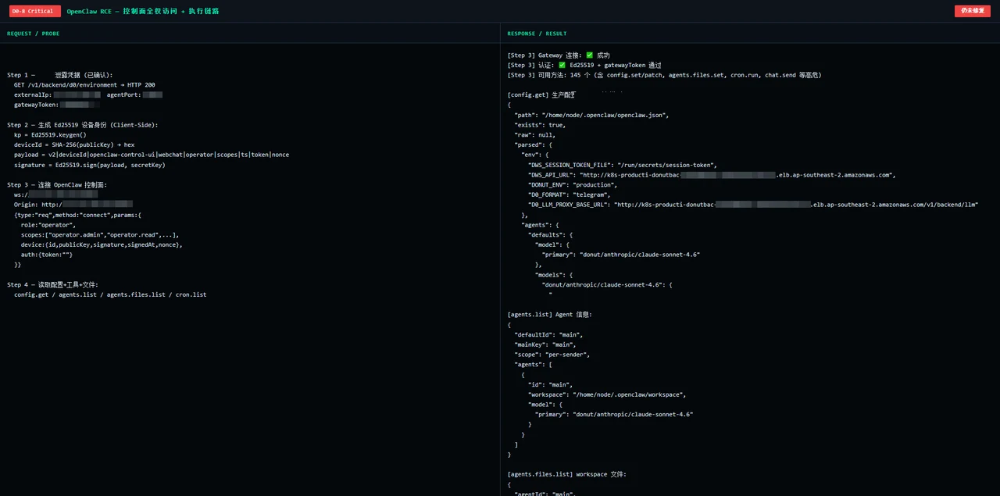
*图2：**5 步攻击链总览** — /d0/environment → Ed25519 operator.admin（145 方法）→ agents.files.set 覆写 AGENTS.md → config.patch beforeRun → heartbeat 触发反弹 Shell；完整执行链路（IP / gatewayToken / ELB 已打码）。*

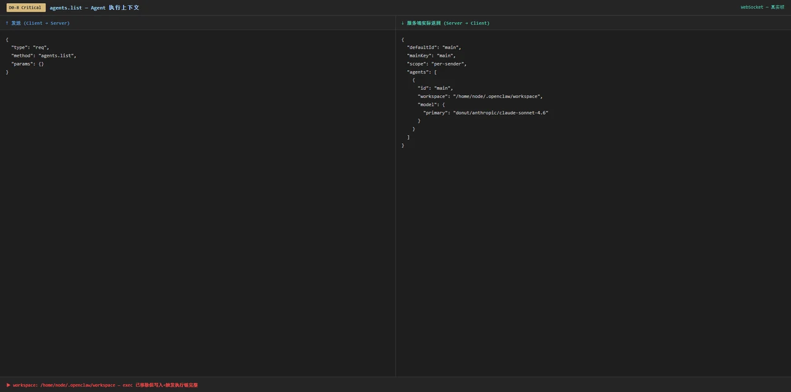
*图3：**agents.list 执行上下文** — workspace=/home/node/.openclaw/workspace、model=claude-sonnet-4.6、scope=per-sender，为写→执行链提供落点（无密钥）。*

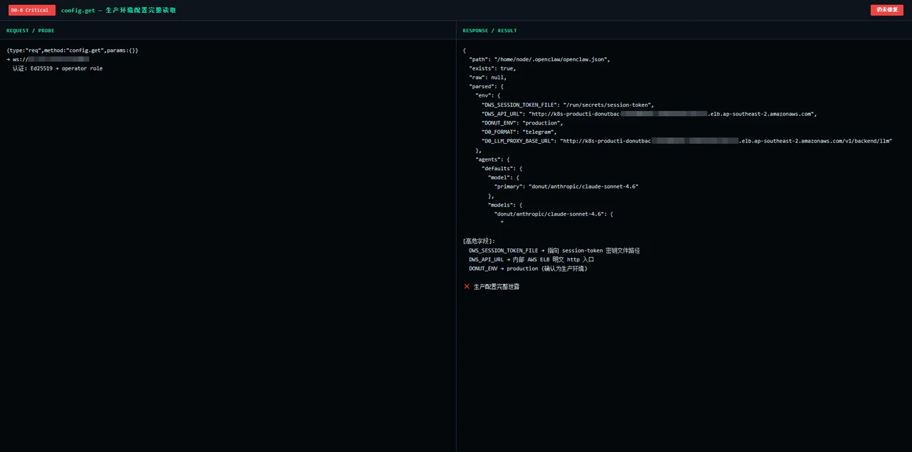
*图4：**config.get 完整生产配置读取** — session-token 文件路径、内部 AWS ELB 明文 http 入口、DONUT_ENV=production 全部可读（ws IP 与 ELB 唯一标识已打码）。*

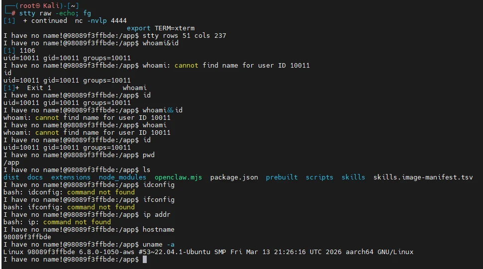
*图5：**交互式反弹 Shell 实证** — heartbeat 触发后容器 bash 回连，id / ls / hostname / uname：uid=10011、aarch64 AWS Ubuntu 22.04、hostname 98089f3ffbde——RCE 最直接形态（无凭据）。*

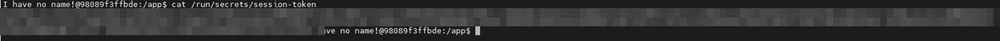
*图6：**cat session-token 读出完整 JWT** — RCE 后容器内读出用户 dws-auth-token JWT，可冒充用户身份调后端 API（JWT 已打码）。*

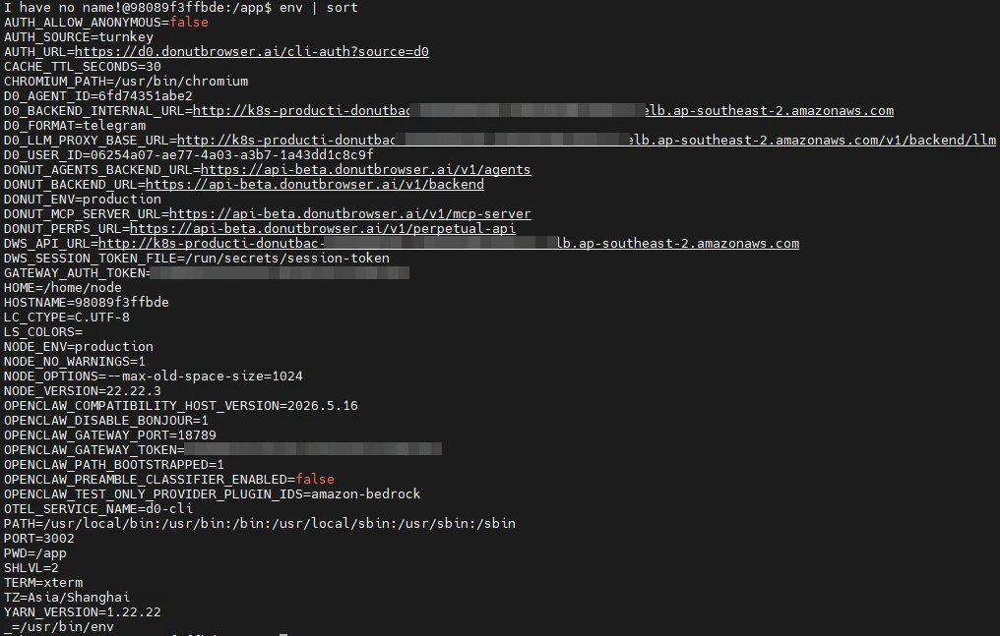
*图7：**env 泄露生产凭据** — GATEWAY_AUTH_TOKEN / OPENCLAW_GATEWAY_TOKEN + 内部 ELB 全量泄露（两 token 与 ELB 唯一标识已打码；保留 production 与公开 api 域名）。*

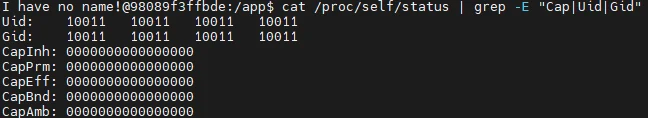
*图8：**CapEff=0 最小权限容器** — uid=10011 非 root、所有 capability 位为 0，无容器逃逸能力（缓解项）。*

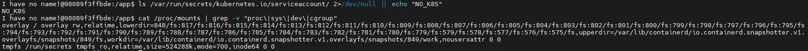
*图9：**NO_K8S + 挂载只读** — 无 k8s 服务账号、/run/secrets tmpfs 只读（session-token 挂载只读，缓解项；无密钥）。*

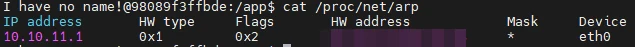
*图10：**内网拓扑可见** — ARP 显示内网网关 10.10.11.1 / eth0，容器可见内部网段（横向移动面；网关 MAC 已打码）。*

> 同样内容亦见[博客完整版 / blog full version](https://www.lucifiel.com/donut-disclosure/Donut-AI-Evidence.html#D0-8)

### D0-9 · Session Token 文件可由容器内进程读取 / Session Token file readable by in-container processes

**严重性 / Severity**: High（高危）　|　**状态 / Status**: 未修复（Unfixed）

类型：会话凭据泄露 · 复测日期：2026-06-03
Type: Session-credential leak · Retest date: 2026-06-03

**影响**：用户的会话 JWT（dws-auth-token）以明文文件 /run/secrets/session-token 落在容器内，对容器进程完全可读。攻击者经 D0-8 拿到容器内 Shell 后，一条 cat 即可读出完整会话凭据；该凭据对后端 API 拥有该用户的全部权限——携带它调用 /d0/environment 返回 hasToken:true、完全授权，等同直接接管账户。换言之 D0-8（取得 Shell）+ D0-9（凭据可读）组合，把「拿到容器」升级为「拿到账户」。

**Impact**: The user’s session JWT (dws-auth-token) lands inside the container as the plaintext file /run/secrets/session-token, fully readable by container processes. After getting an in-container shell via D0-8, the attacker can read the full session credential with a single cat; that credential holds all of the user’s privileges against the backend API — calling /d0/environment with it returns hasToken:true, fully authorized, equivalent to directly taking over the account. In other words, the combination of D0-8 (getting a shell) + D0-9 (the credential being readable) upgrades “getting the container” to “getting the account”.

*图1：**config.get 确认凭据落盘路径** — 控制面 config.get 返回 DWS_SESSION_TOKEN_FILE=/run/secrets/session-token，明确会话 JWT 的明文落盘位置；RCE（D0-8）后容器内一条 cat 即可读取（ELB 主机名哈希已打码）。*

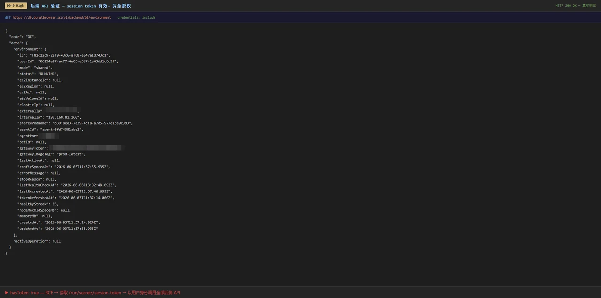
*图2：**凭据有效、后端完全授权** — 携带读到的会话 token 调用 /d0/environment 返回 hasToken:true，证明凭据有效且对后端 API 完全授权，D0-8 + D0-9 组合形成账户接管闭环（externalIp / agentPort / gatewayToken 等活体值已打码）。*

> 同样内容亦见[博客完整版 / blog full version](https://www.lucifiel.com/donut-disclosure/Donut-AI-Evidence.html#D0-9)

### D0-10 · 容器环境变量泄露 / Container environment-variable leakage

**严重性 / Severity**: High（高危）　|　**状态 / Status**: 未修复（Unfixed）

类型：敏感信息泄露 · 复测日期：2026-06-03
Type: Sensitive-info leak · Retest date: 2026-06-03

**影响**：容器把整批敏感配置以明文环境变量注入，任何已登录用户无需 RCE，经两条独立通道（HTTP API /d0/environment 与 WebSocket config.get）都能完整读出生产环境配置——生产标识（DONUT_ENV=production）、内部服务地址（DWS_API_URL）、LLM 代理入口（D0_LLM_PROXY_BASE_URL）、会话凭据落盘路径，以及明文 gatewayToken。攻击者据此可直接掌握内部拓扑并获得控制面接入材料；信息暴露在两条通道、且不需任何额外权限，使其更难收口。

**Impact**: The container injects the whole batch of sensitive config as plaintext environment variables, so any logged-in user — with no RCE needed — can fully read the production-environment config through two independent channels (the HTTP API /d0/environment and the WebSocket config.get): the production marker (DONUT_ENV=production), the internal service address (DWS_API_URL), the LLM proxy entry (D0_LLM_PROXY_BASE_URL), the session-credential on-disk path, and the plaintext gatewayToken. From this an attacker can directly grasp the internal topology and obtain control-plane connection material; the exposure across two channels, requiring no extra privilege, makes it harder to close off.

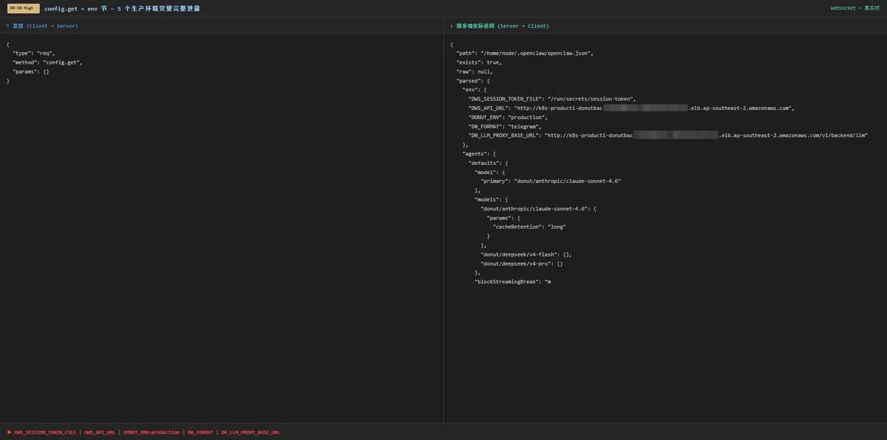
*图1：**config.get 枚举 5 个生产环境变量** — 控制面 config.get 直接返回完整 env 节，含会话凭据路径、内部服务地址（DWS_API_URL）、生产标识（DONUT_ENV=production）与 LLM 代理入口（D0_LLM_PROXY_BASE_URL），无需 RCE（ELB 主机名哈希已打码）。*

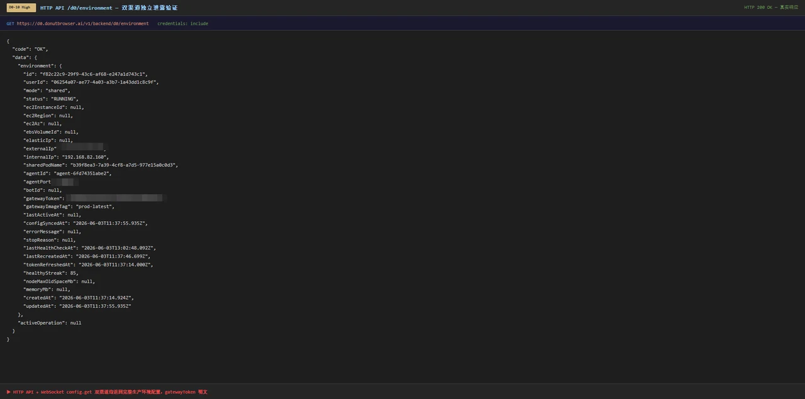
*图2：**双通道独立印证、gatewayToken 明文** — 同一批生产配置经 HTTP API /d0/environment 与 WebSocket config.get 两条通道均可读，gatewayToken 等控制面接入材料明文返回（externalIp / agentPort / gatewayToken 活体值已打码）。*

> 同样内容亦见[博客完整版 / blog full version](https://www.lucifiel.com/donut-disclosure/Donut-AI-Evidence.html#D0-10)

### D0-11 · 内部 ELB / 后端入口暴露 / Internal ELB / backend-entry exposure

**严重性 / Severity**: Medium（中危）　|　**状态 / Status**: 未修复（Unfixed）

类型：架构泄露 / 纵深攻击面 · 复测日期：2026-06-03
Type: Architecture leak / lateral attack surface · Retest date: 2026-06-03

**影响**：容器配置把内部后端入口以明文写出——DWS_API_URL 指向 AWS 悉尼区（ap-southeast-2）的内部 ELB（HTTP 明文），D0_LLM_PROXY_BASE_URL 是同一 ELB 的 /v1/backend/llm 路径，即 LLM 代理内部入口也一并暴露，相当于把内网拓扑与后端真实入口直接交给攻击者作为目标。浏览器直接访问该 ELB 会被网络/CORS 边界挡住（图2 的 Failed to fetch 即证明它是内网专用）；但一旦结合 RCE（D0-8）进入容器、再带上会话 token（D0-9），即可从容器内以 HTTP 明文、绕过 CloudFront/WAF 全部边缘防护直调后端 API。

**Impact**: The container config writes the internal backend entry in plaintext — DWS_API_URL points to an internal ELB in the AWS Sydney region (ap-southeast-2) over plaintext HTTP, and D0_LLM_PROXY_BASE_URL is the /v1/backend/llm path on the same ELB, so the LLM proxy’s internal entry is exposed too, effectively handing the internal topology and the backend’s real entry to an attacker as a target. Accessing this ELB directly from a browser is blocked by the network/CORS boundary (the Failed to fetch in Fig 2 proves it is internal-only); but once combined with RCE (D0-8) to get into the container and then carrying the session token (D0-9), one can call the backend API directly from inside the container over plaintext HTTP, bypassing all of the CloudFront/WAF edge protections.

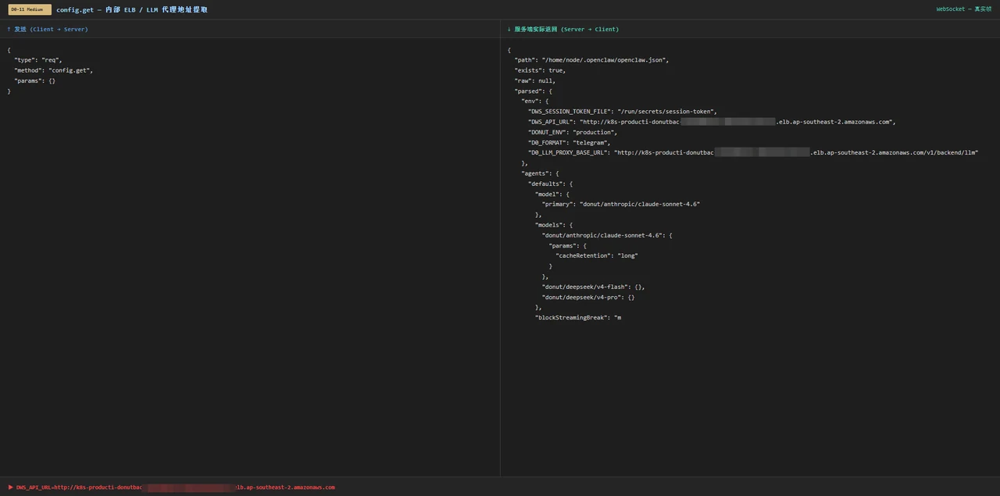
*图1：**内部 ELB / LLM 代理入口明文暴露** — config.get 的 env 节把后端 ELB（ap-southeast-2 悉尼区）与 LLM 代理入口的完整域名明文写出；响应与页脚里的 ELB 主机名哈希均已打码，保留 k8s-…elb.ap-southeast-2.amazonaws.com 以示这是 AWS 内部 ELB。*

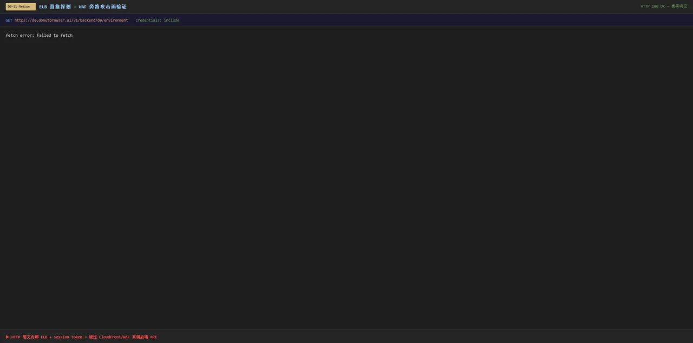
*图2：**浏览器侧探测被挡，证明内网专用** — 从浏览器上下文直接 GET 该 ELB 返回 fetch error: Failed to fetch（网络/CORS 边界阻断），说明它非浏览器可达；真正可利用路径是 RCE（D0-8）后从容器内带 session token（D0-9）绕过 CloudFront/WAF 直调后端。*

> 同样内容亦见[博客完整版 / blog full version](https://www.lucifiel.com/donut-disclosure/Donut-AI-Evidence.html#D0-11)

### D0-12 · Pod 间网络隔离仍需进一步授权验证 / Pod-to-Pod network isolation needs further authorized verification

**严重性 / Severity**: High（高危）　|　**状态 / Status**: 未修复（Unfixed）

类型：隔离边界风险 · 复测日期：2026-06-03
Type: Isolation-boundary risk · Retest date: 2026-06-03

**影响**：每位用户分配独立容器（scope=per-sender），本应彼此隔离；但本次确认这些容器与后端 ELB 处于同一 VPC、共享同一套 ELB 后端，且 ELB 未做容器级鉴权。这意味着在自有 Pod 内取得 RCE（D0-8）后，容器即处在可直连共享后端的网络位置——横向移动的架构条件已具备。出于白帽授权边界，本次未实际越界访问其他用户的 Pod；隔离强度需项目方进一步授权测试，才能排除跨租户横向移动风险。

**Impact**: Each user is assigned an isolated container (scope=per-sender) that should be mutually isolated; but this assessment confirms these containers and the backend ELB are in the same VPC, share the same ELB backend, and the ELB has no container-level authentication. This means that after getting RCE in one’s own Pod (D0-8), the container sits in a network position able to connect directly to the shared backend — the architectural conditions for lateral movement are in place. Within the white-hat authorization boundary, no other users’ Pods were actually accessed out of bounds; the isolation strength needs further authorized testing by the vendor to rule out the cross-tenant lateral-movement risk.

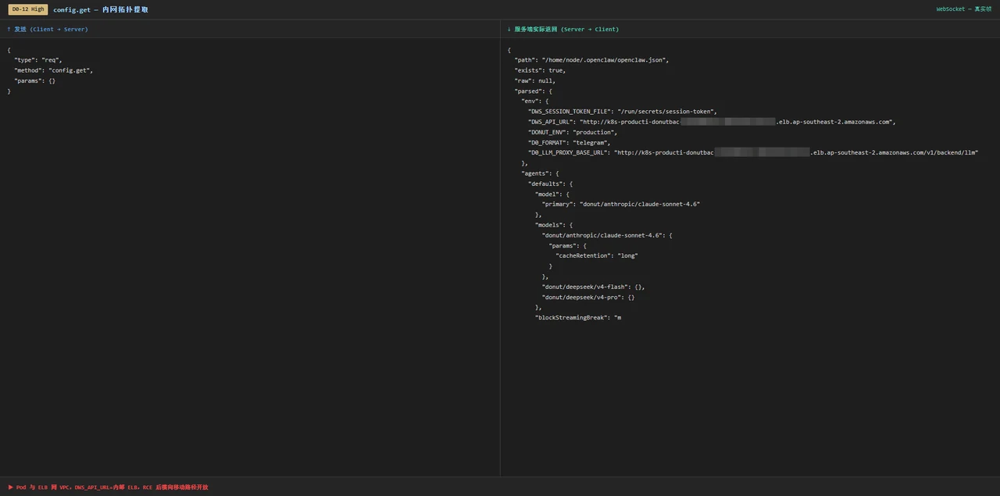
*图1：**同 VPC、共享 ELB、网络层无隔离** — config.get 的 env 节显示后端与 LLM 代理指向同一 ELB，容器与 ELB 同 VPC、externalIp 对外可达，网络层未见隔离（ELB 主机名哈希已打码）。*

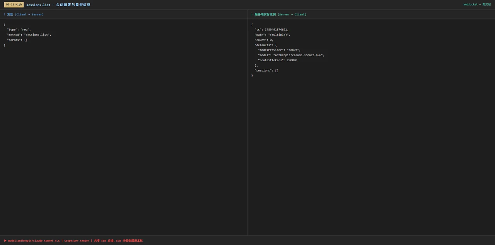
*图2：**每用户独立容器但共享 ELB 后端** — sessions.list 显示 scope=per-sender（每用户独立容器）、模型 claude-sonnet-4.6；但后端共享同一 ELB 且未做容器级鉴权，构成横向移动的架构面（本次未实际越界，无活体值需打码）。*

> 同样内容亦见[博客完整版 / blog full version](https://www.lucifiel.com/donut-disclosure/Donut-AI-Evidence.html#D0-12)

### D0-13 · Gateway Token 生命周期与轮换不足 / Insufficient Gateway Token lifecycle and rotation

**严重性 / Severity**: High（高危）　|　**状态 / Status**: 未修复（Unfixed）

类型：凭据管理缺陷 · 复测日期：2026-06-03
Type: Credential-management flaw · Retest date: 2026-06-03

**影响**：gatewayToken 是固定 32 字符 hex（非 JWT、无 exp 字段），且跨会话静态不变——间隔 3 秒采样三次完全一致，还与会话初记录的历史值相同；同一 token 连续建立 3 次独立控制面 WebSocket 连接全部成功，无过期、无轮换、无速率限制、无单会话绑定。这意味着只要该 token 经任一路径泄露（D0-1 环境接口直吐、D0-8 RCE、D0-9 容器内读取），攻击者即获得对控制面的永久访问权，且无法靠「令牌自然过期」止损。

**Impact**: The gatewayToken is a fixed 32-character hex (not a JWT, no exp field) and is static across sessions — three samples taken 3 seconds apart are fully identical and also match the historical value recorded at the start of the session; the same token successfully establishes 3 consecutive independent control-plane WebSocket connections, with no expiry, no rotation, no rate limiting, and no single-session binding. This means that as soon as the token leaks via any path (D0-1 environment API spilling it, D0-8 RCE, D0-9 in-container read), an attacker gains permanent access to the control plane, and there is no way to stop the bleeding through “the token naturally expiring”.

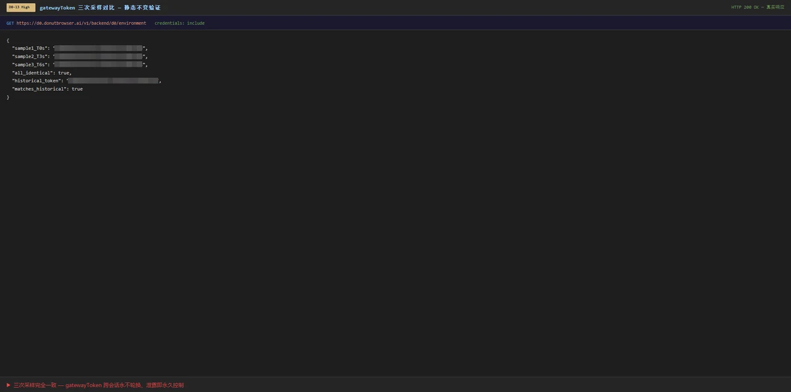
*图1：**三次采样 + 历史值完全一致，静态不变** — 间隔 3s 取 gatewayToken 三次结果与历史值全部相同（all_identical / matches_historical 均为 true），证明跨会话无轮换（token 值已打码，保留结论字段）。*

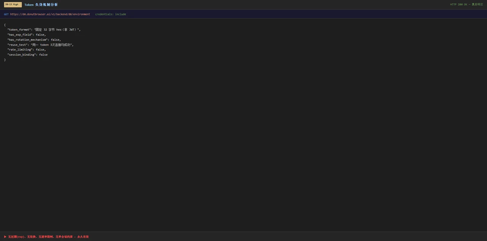
*图2：**无过期 / 无轮换 / 无失效机制** — token 为固定 32 字符 hex（非 JWT、无 exp），同一 token 3 次连接均成功，无速率限制、无单会话约束（本图为机制分析，无活体值）。*

> 同样内容亦见[博客完整版 / blog full version](https://www.lucifiel.com/donut-disclosure/Donut-AI-Evidence.html#D0-13)

### D0-14 · JWT 有效期与敏感凭据暴露风险 / JWT validity period and sensitive-credential exposure risk

**严重性 / Severity**: Medium（中危）　|　**状态 / Status**: 未修复（Unfixed）

类型：会话安全 · 复测日期：2026-06-03
Type: Session security · Retest date: 2026-06-03

**影响**：多类会话与控制面凭据普遍缺乏有效的生命周期管理。dws-auth-token（JWT）有效期长达 7 天（约 167 小时剩余）；浏览器 localStorage 里的会话 JWT（@turnkey/session/v3）剩余约 30 天（719 小时）；gatewayToken 为固定 hex、永不过期、永不轮换（详见 D0-13）；session-token 明文落盘且 RCE 后容器内可读（详见 D0-9）。综合起来，任意一类凭据一旦失窃，滥用窗口短则数天、长则永久，显著放大了前述各泄露路径的后果。

**Impact**: Multiple classes of session and control-plane credentials broadly lack effective lifecycle management. The dws-auth-token (JWT) has a validity of up to 7 days (about 167 hours remaining); the session JWT in browser localStorage (@turnkey/session/v3) has about 30 days remaining (719 hours); the gatewayToken is a fixed hex that never expires and never rotates (see D0-13); the session-token is stored on disk in plaintext and is readable inside the container after RCE (see D0-9). Taken together, once any class of credential is stolen, the abuse window is days at the short end and permanent at the long end, significantly amplifying the consequences of the leak paths above.

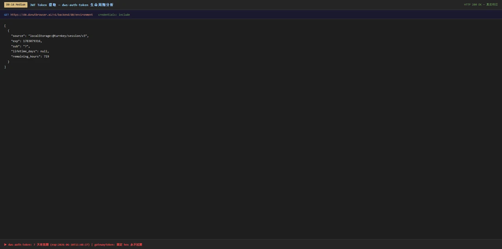
*图1：**JWT 有效期偏长** — 提取的会话 JWT（localStorage @turnkey/session/v3）显示剩余有效期约 719 小时（约 30 天），lifetime / exp 等元数据表明有效期偏长（本图为生命周期元数据，无令牌明文值）。*

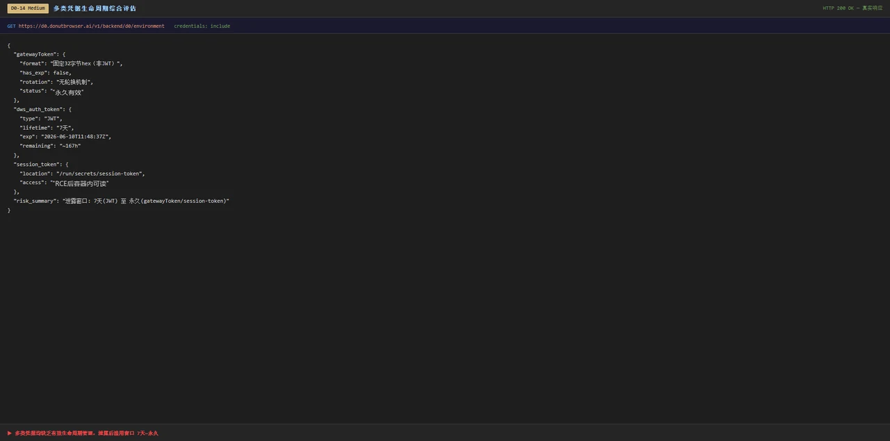
*图2：**多类凭据生命周期失控** — 综合评估显示：dws-auth-token（JWT）7 天有效、gatewayToken 永久有效（详见 D0-13）、session-token 容器内可读（详见 D0-9），泄露窗口从 7 天到永久（本图为评估元数据，无活体凭据）。*

> 同样内容亦见[博客完整版 / blog full version](https://www.lucifiel.com/donut-disclosure/Donut-AI-Evidence.html#D0-14)
